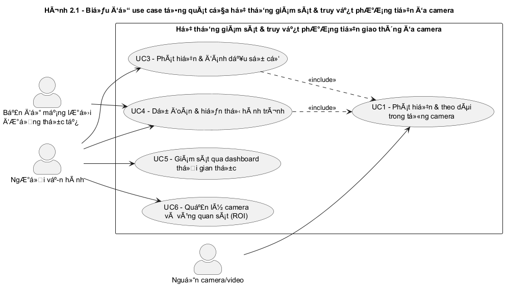
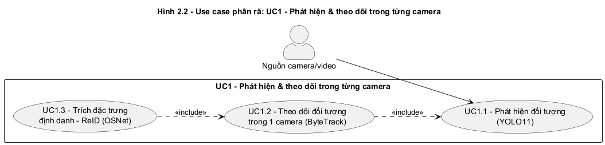
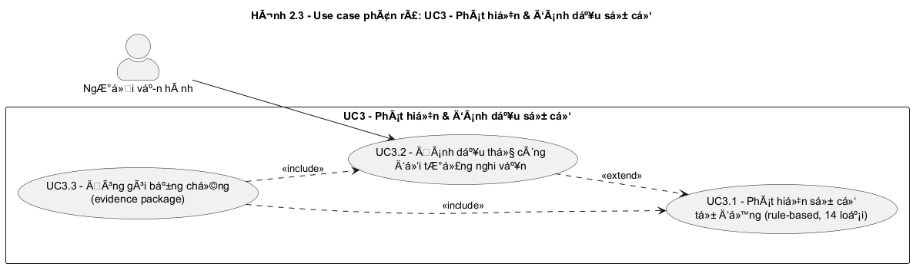
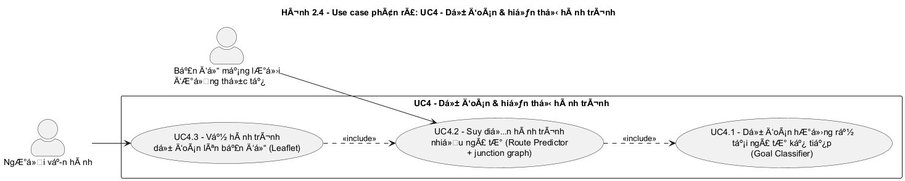
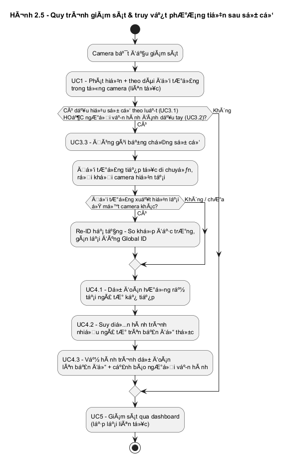

# CHƯƠNG 2. KHẢO SÁT VÀ PHÂN TÍCH YÊU CẦU

> Chương 1 đã đặt vấn đề về tình trạng camera CCTV giao thông tại Việt Nam hiện
> nay chỉ ghi hình thụ động, không có khả năng theo dõi một phương tiện xuyên
> suốt nhiều camera và không dự đoán được hướng di chuyển tiếp theo của
> phương tiện. Chương 2 đi sâu vào quá trình khảo sát hiện trạng và phân tích
> yêu cầu cho hệ thống đề xuất. Phần 2.1 khảo sát các giải pháp giám sát/theo
> dõi đa camera đã tồn tại và đặc điểm giao thông đô thị Việt Nam; phần 2.2
> trình bày tổng quan chức năng hệ thống thông qua biểu đồ use case; phần 2.3
> đặc tả chi tiết các use case quan trọng nhất theo đúng luồng xử lý của hệ
> thống; phần 2.4 liệt kê các yêu cầu phi chức năng.

---

## 2.1 Khảo sát hiện trạng

### Hiện trạng giám sát giao thông bằng camera tại Việt Nam

Tại các đô thị lớn của Việt Nam, số lượng camera CCTV lắp đặt tại các giao lộ,
tuyến đường chính đã tăng nhanh trong những năm gần đây, nhưng phần lớn vẫn
hoạt động theo mô hình ghi hình và truyền hình ảnh thuần túy: hình ảnh được
đổ về một phòng điều khiển trung tâm và do con người trực tiếp quan sát qua
lưới màn hình (camera wall). Mô hình này có ba hạn chế cố hữu. Thứ nhất, một
người vận hành không thể quan sát liên tục hàng chục màn hình cùng lúc, nên
phần lớn sự cố (va chạm, dừng xe đột ngột, đi ngược chiều, tụ tập đông người)
chỉ được phát hiện *sau khi* đã xảy ra, qua xem lại đoạn ghi hình. Thứ hai,
mỗi camera hoạt động độc lập, không có "trí nhớ" xuyên camera: khi một
phương tiện đi ra khỏi khung hình của camera này và xuất hiện ở camera khác,
hệ thống không có cách nào tự động khẳng định đó là cùng một phương tiện —
muốn truy vết, người vận hành phải tự tay rà từng đoạn video. Thứ ba, hệ
thống chỉ phản ứng (reactive) khi sự việc đã xảy ra, không có khả năng cảnh
báo sớm hoặc dự đoán phương tiện sẽ di chuyển theo hướng nào trong những giây
hoặc những ngã tư tiếp theo — thông tin rất quan trọng để lực lượng chức năng
quyết định chốt chặn ở đâu sau khi một phương tiện gây tai nạn rời khỏi hiện
trường.

### Các hướng giải quyết liên quan và hạn chế

Hướng nghiên cứu *theo dõi đa đối tượng* (Multi-Object Tracking — MOT) đơn
camera đã khá trưởng thành. Các thuật toán theo mô hình tracking-by-detection
như DeepSORT, StrongSORT và ByteTrack kết hợp một bộ phát hiện đối tượng
(YOLO, Faster R-CNN...) với Kalman Filter và thuật toán ghép cặp (Hungarian
matching) để gán ID ổn định cho từng đối tượng trong một luồng video. Tuy
nhiên, các thuật toán này chỉ giải quyết bài toán trong phạm vi *một* camera;
khi đối tượng rời khỏi khung hình, ID bị mất hoàn toàn và không có cơ chế nối
lại ID đó ở một camera khác.

Hướng nghiên cứu *theo dõi đa camera, đa mục tiêu* (Multi-Target
Multi-Camera Tracking — MTMC), với đại diện tiêu biểu là CityFlow, giải quyết
đúng vấn đề "trí nhớ xuyên camera" bằng cách kết hợp tracking đơn camera với
một mô-đun nhận diện lại (Re-Identification — ReID) để so khớp đối tượng giữa
các camera dựa trên đặc trưng hình ảnh (vehicle/person re-id embedding). Hạn
chế của các bộ dữ liệu và mô hình MTMC công khai là chúng được xây dựng trên
dữ liệu giao thông phương Tây, với cơ cấu phương tiện gần như không có xe
máy — khác hẳn với đặc thù giao thông Việt Nam, nơi xe máy chiếm tỷ trọng áp
đảo và có kiểu di chuyển (lấn làn, len lỏi, đổi hướng linh hoạt) không giống
ô tô. Bên cạnh đó, các hệ thống này tập trung vào bài toán định danh
(re-identification) mà không đi tiếp đến bài toán dự đoán hướng đi tương lai
của phương tiện trên một bản đồ đường thực tế.

Gần với đúng bối cảnh giao thông Việt Nam hơn, Chau et al. [1] giải quyết bài
toán dự đoán quỹ đạo phương tiện trực tiếp trên video CCTV tại Hà Nội/TP. Hồ
Chí Minh — đúng đặc thù giao thông hỗn
loạn, nhiều xe máy mà các bộ dữ liệu MTMC phương Tây không có. Hướng tiếp cận
của công trình này là YOLOv7 (phát hiện) + DeepSORT (theo dõi) thu thập toạ
độ phương tiện, sau đó dùng mô hình lai CNN-LSTM/CNN-GRU dự đoán vị trí tương
lai — toàn bộ trong phạm vi **một camera duy nhất**, không có bước nhận diện
lại xuyên camera. Kết quả này cho thấy dự đoán quỹ đạo trong giao thông hỗn
loạn là một bài toán nghiên cứu có giá trị độc lập, không nhất thiết phải
giải quyết xong bài toán theo dõi xuyên camera mới có ý nghĩa — đây là cơ sở
để đề tài này xác định **dự đoán hướng đi dài hạn (UC4)** là trọng tâm đóng
góp chính, còn theo dõi xuyên camera là một năng lực hạ tầng hỗ trợ cho việc
truy vết sau đánh dấu (không đặc tả như một use case riêng — mục 2.4), có
hạn chế đã biết với xe máy (Chương 5, mục 5.5.8) và không phải tiêu chí
chính để đánh giá thành công của đề tài.

Ở nhóm sản phẩm thương mại, các nền tảng giám sát giao thông tại Việt Nam
hiện nay (hệ thống camera phạt nguội, hệ thống đèn tín hiệu "thông minh" tại
Hà Nội/TP. Hồ Chí Minh) chủ yếu phục vụ hai chức năng: đếm lưu lượng phương
tiện theo làn/hướng và phát hiện vi phạm để xử phạt (vượt đèn đỏ/vượt vạch
dừng đèn đỏ, đi sai làn, quá tốc độ) — các hệ thống phạt nguội này có đọc và
lưu biển số xe vi phạm, nhưng chỉ để phục vụ xử phạt hành chính ngay tại
camera/giao lộ ghi nhận vi phạm. Các hệ thống này hoạt động trên từng
camera/giao lộ riêng lẻ, không công khai khả năng theo dõi liên tục một
phương tiện cụ thể qua nhiều giao lộ, không gắn biển số đã đọc được với một
đối tượng đang được đánh dấu để truy vết tiếp, và không có chức năng dự đoán
hành trình tiếp theo của phương tiện để hỗ trợ truy vết sau sự cố.

Bảng 2.1 tổng hợp so sánh các hướng giải quyết đã khảo sát với định hướng của
hệ thống đề xuất.

**Bảng 2.1: So sánh các hệ thống giám sát/theo dõi giao thông liên quan**

| Tiêu chí | DeepSORT/ StrongSORT | ByteTrack | CityFlow (MTMC) | Chau et al. [1] (Chaotic Traffic) | CCTV giao thông VN hiện có | Hệ thống đề xuất |
|---|---|---|---|---|---|---|
| Theo dõi trong 1 camera | ✓ | ✓ | ✓ | ✓ | ✓ | ✓ |
| Theo dõi xuyên nhiều camera (Re-ID) | – | – | ✓ | – | – | ✓ hạ tầng (hạn chế với xe máy) |
| Phát hiện sự cố tự động (dừng đột ngột, ngược chiều...) | – | – | – | – | Một phần (vi phạm đèn đỏ/tốc độ) | ✓ |
| Đánh dấu đối tượng nghi vấn để truy vết | – | – | – | – | – | ✓ |
| Dự đoán hướng đi tại ngã tư tiếp theo | – | – | – | Một phần (toạ độ tương lai, không phân loại hướng tại ngã tư) | – | ✓ |
| Suy diễn hành trình nhiều ngã tư và vẽ lên bản đồ thực | – | – | – | – | – | ✓ |
| Phù hợp cơ cấu phương tiện Việt Nam (tỷ trọng xe máy cao) | – | – | – | ✓ | Một phần | ✓ |
| Hoạt động trên video CCTV thật, không cần phần cứng chuyên dụng | ✓ | ✓ | ✓ (cần dữ liệu lớn) | ✓ | ✓ | ✓ |
| Lưu biển số xe của đối tượng đang được đánh dấu/truy vết | – | – | – | – | ✓ (chỉ để xử phạt, không gắn theo dõi liên tục) | ✓ (gắn với đối tượng đang truy vết) |

✓: Có hỗ trợ  –: Không hỗ trợ

### Đặc điểm giao thông đô thị Việt Nam ảnh hưởng đến yêu cầu hệ thống

Khảo sát thực tế qua các đoạn video CCTV thu thập tại một số giao lộ Hà Nội
(trong đó có giao lộ Phố Huế – Trần Khát Chân, được dùng làm địa bàn khảo sát
và kiểm thử chính của đề tài) cho thấy một số đặc điểm ảnh hưởng trực tiếp
đến yêu cầu thiết kế hệ thống. Thứ nhất, mật độ và tỷ trọng xe máy rất cao,
xe máy thường di chuyển sát nhau, che khuất lẫn nhau và đổi hướng linh hoạt
hơn ô tô, khiến việc theo dõi liên tục từng phương tiện trong một camera dễ
bị đứt đoạn (occlusion) và việc phân biệt phương tiện qua đặc trưng hình ảnh
khó hơn so với phương tiện cỡ lớn. Thứ hai, các giao lộ trong khu vực nội đô
thường có hình học phức tạp (nhiều nhánh, đường một chiều, dải phân cách cho
phép quay đầu), khiến hướng đi của một phương tiện tại ngã tư không thể suy
luận đơn giản bằng ngoại suy đường thẳng từ vài khung hình gần nhất. Thứ ba,
camera giám sát thực tế hầu hết không có thông tin định vị tuyệt đối (GPS)
gắn theo từng phương tiện — mọi suy luận về vị trí, vận tốc, hướng di chuyển
đều phải được ước lượng từ toạ độ pixel trên ảnh, khác với các bài toán có
sẵn dữ liệu định vị chính xác. Thứ tư, camera giám sát giao thông được lắp
đặt để quan sát toàn cảnh giao lộ (góc rộng, khoảng cách xa) chứ không phải
camera chuyên chụp biển số (góc hẹp, gắn gần sát làn xe) — độ phân giải và
khoảng cách này ảnh hưởng trực tiếp đến khả năng đọc được biển số xe, đặc
biệt với xe máy (kích thước biển nhỏ hơn ô tô). Những đặc điểm này đặt ra
yêu cầu cho hệ thống: phải hoạt động được trực tiếp trên dữ liệu pixel-space
của video CCTV thật (không phụ thuộc cảm biến định vị gắn trên phương
tiện), phải chống nhiễu tốt trước các phát hiện/track chập chờn, phải coi
dự đoán hướng đi là một bài toán xác suất (có độ tin cậy đi kèm) hơn là một
khẳng định chắc chắn, và phải coi việc đọc được biển số là một thông tin bổ
sung "khi điều kiện hình ảnh cho phép" chứ không thể đảm bảo có ở mọi đối
tượng được đánh dấu.

### Tổng hợp yêu cầu

Từ kết quả khảo sát, đề tài xác định bốn nhóm tính năng chính cần xây dựng
cho một hệ thống đích đến gồm **6 camera giám sát** chạy đồng thời, trong đó
**(iii) — dự đoán hướng đi dài hạn — là trọng tâm đóng góp chính**, đặt cạnh
công trình gần nhất cùng bối cảnh giao thông Việt Nam (Chau et al. [1])
nhưng đi xa hơn ở việc suy diễn nhiều ngã tư liên tiếp trên bản đồ đường
thực, không chỉ ngoại suy toạ độ ngắn hạn; các nhóm còn lại là hạ tầng cần
thiết để vận hành (iii) trên dữ liệu thật: (i) phát hiện và theo dõi đối
tượng theo thời gian thực trong từng camera; (ii) phát hiện sự cố giao thông
tự động — gồm các vi phạm giao thông cụ thể (vượt đèn đỏ/vượt vạch dừng đèn
đỏ, đi sai làn) cùng các tình huống bất thường khác — và cho phép người vận
hành đánh dấu thủ công một đối tượng nghi vấn, đồng thời lưu lại biển số xe
của đối tượng được đánh dấu khi điều kiện hình ảnh cho phép; (iii) dự đoán
hướng đi của phương tiện tại ngã tư sắp tới và suy diễn tiếp hành trình dài
hạn qua nhiều ngã tư trên bản đồ đường thực tế; (iv) cung cấp giao diện giám
sát thời gian thực (luồng video, cảnh báo, bản đồ hành trình dự đoán) cho
người vận hành. Việc duy trì định danh nhất quán khi một đối
tượng di chuyển qua nhiều camera (gán Global ID, Re-ID) vẫn là một năng lực
hạ tầng cần có để (i)–(iii) hoạt động đúng trên một khu vực nhiều camera,
nhưng — do hạn chế đã biết với xe máy (xem Chương 5, mục 5.5.8) — đề tài
không đặc tả năng lực này như một use case độc lập, mà xử lý ở mức yêu cầu
phi chức năng (mục 2.4).

---

## 2.2 Tổng quan chức năng

Hệ thống có ba tác nhân. Tác nhân chính là **Người vận hành** (cán bộ giám
sát/cảnh sát giao thông), tương tác với hệ thống qua giao diện dashboard để
xem luồng camera, nhận cảnh báo, đánh dấu đối tượng nghi vấn và xem hành
trình dự đoán trên bản đồ. Hai tác nhân phụ là **Nguồn camera/video** (camera
IP qua RTSP, file video, hoặc webcam — hệ thống trừu tượng hoá thành một lớp
nguồn video chung để có thể đổi nguồn mà không phải sửa lại pipeline AI) cung
cấp khung hình đầu vào liên tục, và **Bản đồ mạng lưới đường thực tế** (xây
dựng từ dữ liệu OpenStreetMap của khu vực giám sát, chuyển đổi thành đồ thị
giao lộ — nút là giao lộ, cạnh là đoạn đường) cung cấp cấu trúc đường để hệ
thống chiếu hành trình dự đoán lên.

### 2.2.1 Biểu đồ use case tổng quát

**Hình 2.1: Biểu đồ use case tổng quát**

Năm use case mức cao gồm:

- **UC1 – Phát hiện và theo dõi trong từng camera**: hệ thống phát hiện
  người/phương tiện trên mỗi khung hình camera và gán một ID tạm thời ổn
  định cho từng đối tượng trong phạm vi một camera. Việc nhận diện lại khi
  đối tượng đi từ camera này sang camera khác (gán Global ID) là một năng
  lực hạ tầng đi kèm UC1 (mục 2.4), không đặc tả như một use case riêng do
  hạn chế đã biết với xe máy (Chương 5, mục 5.5.8).
- **UC3 – Phát hiện và đánh dấu sự cố**: hệ thống tự động phát hiện các dấu
  hiệu bất thường (dừng đột ngột, đi ngược chiều, vượt tốc độ...) và cho
  phép người vận hành đánh dấu thủ công một đối tượng cụ thể là đối tượng
  cần truy vết (ví dụ phương tiện gây tai nạn rồi rời khỏi hiện trường).
- **UC4 – Dự đoán và hiển thị hành trình**: với đối tượng đã được đánh dấu
  hoặc đang tiếp cận một ngã tư, hệ thống dự đoán hướng đi tiếp theo và suy
  diễn hành trình nhiều ngã tư, hiển thị trực quan trên bản đồ.
- **UC5 – Giám sát qua dashboard thời gian thực**: người vận hành xem đồng
  thời nhiều luồng camera, danh sách cảnh báo và thống kê hệ thống qua một
  giao diện web cập nhật liên tục.
- **UC6 – Quản lý camera và vùng quan sát**: người vận hành thêm/sửa/xoá
  thông tin camera và các vùng quan tâm (ROI) dùng cho việc phát hiện sự cố
  (vùng nguy hiểm, làn đi ngược chiều...).

### 2.2.2 Biểu đồ use case phân rã – Phát hiện và theo dõi trong từng camera

**Hình 2.2: Biểu đồ use case phân rã – Phát hiện và theo dõi trong từng camera**

- **UC1.1 – Phát hiện đối tượng**: trên mỗi khung hình, hệ thống chạy mô
  hình phát hiện đối tượng để xác định bounding box, nhãn lớp (người đi bộ,
  xe máy, ô tô, xe buýt, xe tải) và độ tin cậy cho từng đối tượng xuất hiện.
- **UC1.2 – Theo dõi đối tượng trong một camera**: hệ thống liên kết các
  phát hiện giữa các khung hình liên tiếp để gán một ID cục bộ (local track
  ID) ổn định cho từng đối tượng, duy trì ID này cả khi đối tượng bị che
  khuất tạm thời.
- **UC1.3 – Trích đặc trưng định danh**: với mỗi track đang được theo dõi,
  hệ thống trích một vector đặc trưng hình ảnh (embedding) từ phần ảnh crop
  của đối tượng, dùng làm "chữ ký" để so khớp lại đối tượng khi nó xuất hiện
  ở một camera khác — một năng lực hạ tầng hỗ trợ (mục 2.4), không đặc tả
  như một use case riêng.

### 2.2.3 Biểu đồ use case phân rã – Phát hiện và xử lý sự cố

**Hình 2.3: Biểu đồ use case phân rã – Phát hiện và xử lý sự cố**

- **UC3.1 – Phát hiện sự cố tự động**: hệ thống áp dụng một tập 14 quy tắc
  trên dữ liệu track (vị trí, vận tốc, hướng di chuyển, vị trí tương đối với
  các vùng quan tâm) để phát hiện các tình huống bất thường, trong đó có ba
  nhóm vi phạm giao thông cụ thể là trọng tâm của đề tài — **vượt đèn đỏ/vượt
  vạch dừng đèn đỏ** (đối tượng di chuyển qua vùng vạch dừng/giao lộ trong
  lúc đèn đỏ), **đi sai làn** (đối tượng không thuộc loại phương tiện/hướng
  được phép trong một làn đã khai báo), và **dừng đỗ sai quy định** — cùng
  các tình huống bất thường khác: dừng đột ngột, tăng tốc bất thường, vượt
  tốc độ cho phép, đi ngược chiều, phương tiện áp sát nhau, người đi bộ vào
  vùng nguy hiểm, tụ tập đông người, lưu lại lâu bất thường (loitering),
  cũng như hai loại cảnh báo chủ động dựa trên dự đoán quỹ đạo ngắn hạn (nguy
  cơ va chạm, nguy cơ đi vào vùng cấm trong vài giây tới).
- **UC3.2 – Đánh dấu thủ công đối tượng nghi vấn**: vì không phải lúc nào
  cảm biến/luật tự động cũng bắt được sự cố (camera thật không có cảm biến
  va chạm), người vận hành có thể chọn trực tiếp một đối tượng đang được
  theo dõi trên giao diện và đánh dấu là "đối tượng cần truy vết" — từ thời
  điểm này hệ thống bắt đầu chạy UC4 cho đúng đối tượng đó.
- **UC3.3 – Đóng gói bằng chứng**: khi có sự cố (tự động hoặc đánh dấu thủ
  công), hệ thống lưu lại đoạn video trước/sau sự cố, ảnh crop các đối tượng
  liên quan, biển số xe của đối tượng liên quan nếu đọc được, và một file
  metadata mô tả đầy đủ thông tin sự cố để phục vụ tra cứu/điều tra sau này.

### 2.2.4 Biểu đồ use case phân rã – Dự đoán và hiển thị hành trình

**Hình 2.4: Biểu đồ use case phân rã – Dự đoán và hiển thị hành trình**

- **UC4.1 – Dự đoán hướng rẽ tại ngã tư kế tiếp**: dựa trên một khoảng thời
  gian quan sát gần nhất của track (vị trí, kích thước khung bao, vận tốc và
  hướng di chuyển ước lượng), hệ thống phân loại hướng đi nhiều khả năng
  nhất khi đối tượng tới ngã tư sắp tới: đi thẳng, rẽ trái, rẽ phải hoặc quay
  đầu, kèm theo xác suất cho từng hướng.
- **UC4.2 – Suy diễn hành trình nhiều ngã tư**: xuất phát từ vị trí và
  hướng dự đoán ở ngã tư đầu tiên, hệ thống duyệt tiếp đồ thị giao lộ của
  bản đồ thực tế để sinh ra một (hoặc nhiều) chuỗi đoạn đường mà đối tượng
  có khả năng đi qua trong vài ngã tư tiếp theo, mỗi chuỗi kèm theo toạ độ
  thực (vĩ độ/kinh độ) và mức độ tin cậy giảm dần theo số ngã tư đi qua.
- **UC4.3 – Vẽ hành trình dự đoán lên bản đồ**: hệ thống hiển thị các chuỗi
  hành trình dự đoán dưới dạng đường đi (polyline) chồng lên bản đồ nền thực
  tế của khu vực, có phân biệt trực quan theo mức độ tin cậy, cùng với vị
  trí hiện tại của đối tượng và các camera liên quan.

### 2.2.5 Quy trình nghiệp vụ

Quy trình nghiệp vụ trung tâm của hệ thống là **quy trình giám sát và truy
vết phương tiện sau sự cố**, kết hợp các use case UC1, UC3, UC4 thành một
luồng hoạt động xuyên suốt — không phải luồng sự kiện riêng của một use case
mà là luồng nghiệp vụ phối hợp nhiều use case để giải quyết bài toán "một
phương tiện gây sự cố rồi bỏ đi, cần xác định nó đang ở đâu và có khả năng đi
đâu tiếp theo".

**Hình 2.5: Biểu đồ hoạt động – Quy trình giám sát và truy vết phương tiện sau sự cố**

Quy trình bắt đầu khi camera được kết nối và hệ thống bật chế độ phát hiện +
theo dõi liên tục (UC1). Trong suốt quá trình giám sát, hệ thống song song
kiểm tra các quy tắc phát hiện sự cố tự động; đồng thời, người vận hành có
thể can thiệp bất cứ lúc nào để đánh dấu thủ công một đối tượng cụ thể. Khi
một đối tượng được xác định là đối tượng cần truy vết (tự động hoặc thủ
công), hệ thống lưu lại bằng chứng liên quan rồi tiếp tục bám theo đối tượng
đó: nếu đối tượng đi khỏi vùng quan sát của camera hiện tại và xuất hiện ở
một camera lân cận, hệ thống sẽ tự động khớp lại đúng định danh xuyên camera
(năng lực hạ tầng Re-ID hỗ trợ, mục 2.4) trước khi đối tượng kịp "biến mất"
khỏi hệ thống theo dõi. Ngay khi vị trí và
hướng đi của đối tượng tại ngã tư gần nhất được xác định, hệ thống chạy dự
đoán hành trình dài hạn (UC4) và hiển thị kết quả trên bản đồ thực tế, giúp
người vận hành — hoặc lực lượng chức năng — có cơ sở để quyết định vị trí
chốt chặn phù hợp thay vì phải chờ xem lại toàn bộ video từ nhiều camera.
Toàn bộ quy trình được phản chiếu liên tục lên dashboard giám sát (UC5).

---

## 2.3 Đặc tả chức năng

Phần này đặc tả chi tiết năm use case quan trọng nhất của hệ thống, trình bày
theo đúng thứ tự luồng xử lý dữ liệu: phát hiện đối tượng → theo dõi trong
một camera → phát hiện/đánh dấu sự cố → dự đoán hướng rẽ → suy diễn và hiển
thị hành trình dài hạn.

### 2.3.1 Đặc tả UC1.1 – Phát hiện đối tượng

**Bảng 2.2: Đặc tả use case UC1.1 – Phát hiện đối tượng**

| Trường | Nội dung |
|---|---|
| Mã use case | UC1.1 |
| Tên use case | Phát hiện đối tượng |
| Tác nhân | Nguồn camera/video |
| Mô tả | Hệ thống chạy mô hình phát hiện đối tượng trên từng khung hình để xác định vị trí và loại của người/phương tiện xuất hiện |
| Tiền điều kiện | Nguồn video (camera IP/file/webcam) đang cấp khung hình hợp lệ; mô hình phát hiện đã được nạp vào bộ nhớ |
| Luồng chính | 1. Hệ thống nhận một khung hình mới từ nguồn video 2. Hệ thống đưa khung hình vào mô hình phát hiện đối tượng 3. Mô hình trả về danh sách ứng viên gồm khung bao (bounding box), nhãn lớp và độ tin cậy 4. Hệ thống lọc các ứng viên theo ngưỡng tin cậy riêng cho từng lớp đối tượng 5. Hệ thống loại bỏ các khung bao trùng lặp bằng kỹ thuật triệt tiêu cực đại địa phương (NMS) 6. Hệ thống trả về danh sách đối tượng đã lọc cho UC1.2 |
| Luồng phát sinh | 3a. Không có đối tượng nào vượt ngưỡng tin cậy: hệ thống trả về danh sách rỗng, tiếp tục xử lý khung hình tiếp theo 1a. Khung hình bị lỗi/hỏng (do mất kết nối camera): hệ thống bỏ qua khung hình này và chờ khung hình kế tiếp |
| Hậu điều kiện | Danh sách đối tượng (khung bao, lớp, độ tin cậy) của khung hình hiện tại được chuyển sang UC1.2 |

### 2.3.2 Đặc tả UC1.2 – Theo dõi đối tượng trong một camera

**Bảng 2.3: Đặc tả use case UC1.2 – Theo dõi đối tượng trong một camera**

| Trường | Nội dung |
|---|---|
| Mã use case | UC1.2 |
| Tên use case | Theo dõi đối tượng trong một camera |
| Tác nhân | Hệ thống (tự động) |
| Mô tả | Hệ thống liên kết các đối tượng phát hiện được giữa các khung hình liên tiếp của cùng một camera, gán một ID cục bộ ổn định cho mỗi đối tượng |
| Tiền điều kiện | UC1.1 đã trả về danh sách đối tượng phát hiện của khung hình hiện tại; có thông tin track đang theo dõi từ khung hình trước (nếu có) |
| Luồng chính | 1. Hệ thống dự đoán vị trí hiện tại của các track đang theo dõi (dựa trên vận tốc ước lượng ở khung hình trước) 2. Hệ thống ghép cặp các đối tượng mới phát hiện với các track đang theo dõi theo độ chồng lấp khung bao (IoU), ưu tiên ghép các phát hiện có độ tin cậy cao trước 3. Với mỗi track ghép được, hệ thống cập nhật vị trí, vận tốc và tăng số khung hình đã theo dõi 4. Với phát hiện không ghép được track nào, hệ thống tạo track mới (ở trạng thái "chưa xác nhận") 5. Một track được "xác nhận" sau khi ghép thành công liên tiếp đủ số khung hình quy định 6. Track không ghép được với phát hiện nào trong một số khung hình liên tiếp sẽ được giữ ở trạng thái "mất dấu tạm thời" rồi xoá hẳn nếu vượt quá thời gian tối đa cho phép |
| Luồng phát sinh | 4a. Đối tượng bị che khuất hoàn toàn một vài khung hình: track tương ứng được giữ ở trạng thái "mất dấu tạm thời" thay vì xoá ngay, và được khớp lại nếu đối tượng xuất hiện trở lại trong thời gian cho phép 2a. Hai track tranh chấp cùng một phát hiện: phát hiện được ưu tiên ghép với track có độ tin cậy ghép cặp cao hơn |
| Hậu điều kiện | Danh sách track cục bộ (kèm ID camera, ID cục bộ, khung bao, lớp đối tượng) của khung hình hiện tại được chuyển sang UC1.3 và UC3.1 |

### 2.3.3 Đặc tả UC3 – Phát hiện và đánh dấu sự cố

**Bảng 2.4: Đặc tả use case UC3 – Phát hiện và đánh dấu sự cố**

| Trường | Nội dung |
|---|---|
| Mã use case | UC3 |
| Tên use case | Phát hiện và đánh dấu sự cố |
| Tác nhân | Hệ thống (tự động), Người vận hành |
| Mô tả | Hệ thống tự động phát hiện các tình huống giao thông bất thường, đồng thời cho phép người vận hành đánh dấu thủ công một đối tượng cụ thể làm đối tượng cần truy vết |
| Tiền điều kiện | Có ít nhất một track (cục bộ hoặc đã có Global ID) đang được theo dõi |
| Luồng chính | 1. Với mỗi track, hệ thống tính các đại lượng cần thiết (vận tốc, gia tốc, hướng di chuyển, vị trí tương đối với các vùng quan tâm đã khai báo) 2. Hệ thống lần lượt kiểm tra các quy tắc phát hiện sự cố, gồm các vi phạm giao thông trọng tâm (vượt đèn đỏ/vượt vạch dừng, đi sai làn, dừng đỗ sai quy định) và các tình huống khác (dừng đột ngột, vượt tốc độ, đi ngược chiều, phương tiện áp sát, người đi bộ vào vùng nguy hiểm, tụ tập đông người...) 3. Nếu một quy tắc được kích hoạt và đã hết thời gian "nghỉ" (cooldown) cho loại sự cố đó trên đối tượng đó, hệ thống phát sinh một cảnh báo sự cố 4. Cảnh báo được đẩy lên giao diện người vận hành theo thời gian thực 5. Người vận hành xem cảnh báo và xác nhận (hoặc bỏ qua) qua dashboard 6. Song song, người vận hành có thể chọn trực tiếp một đối tượng đang hiển thị trên giao diện và gọi hành động "đánh dấu là đối tượng cần truy vết", không phụ thuộc việc quy tắc tự động có kích hoạt hay không |
| Luồng phát sinh | 6a. Đối tượng được chọn để đánh dấu không còn tồn tại trong danh sách track hiện tại (đã mất dấu trước khi người vận hành bấm xác nhận): hệ thống báo lỗi và yêu cầu chọn lại 3a. Quy tắc kích hoạt nhưng đang trong thời gian nghỉ: cảnh báo bị bỏ qua để tránh dội cảnh báo liên tục cho cùng một sự việc |
| Hậu điều kiện | Sự cố/đối tượng được đánh dấu kèm bằng chứng liên quan — gồm biển số xe nếu đọc được — đã được lưu trữ (UC3.3); đối tượng được đánh dấu trở thành đầu vào của UC4 |

### 2.3.4 Đặc tả UC4.1 – Dự đoán hướng rẽ tại ngã tư kế tiếp

**Bảng 2.5: Đặc tả use case UC4.1 – Dự đoán hướng rẽ tại ngã tư kế tiếp**

| Trường | Nội dung |
|---|---|
| Mã use case | UC4.1 |
| Tên use case | Dự đoán hướng rẽ tại ngã tư kế tiếp |
| Tác nhân | Hệ thống (tự động) |
| Mô tả | Với một đối tượng đang được theo dõi (đặc biệt là đối tượng đã được đánh dấu ở UC3), hệ thống dự đoán hướng đi nhiều khả năng nhất khi đối tượng tới ngã tư gần nhất |
| Tiền điều kiện | Đối tượng đã được theo dõi liên tục đủ một khoảng thời gian tối thiểu (đủ số khung hình quan sát gần nhất) |
| Luồng chính | 1. Hệ thống duy trì một cửa sổ lịch sử gần nhất (vị trí, kích thước khung bao, mốc thời gian) cho đối tượng 2. Khi đủ số khung hình tối thiểu, hệ thống tính các đặc trưng mô tả chuyển động trong cửa sổ này (vận tốc, biến động hướng đi, tỉ lệ giảm tốc, các đặc trưng chuẩn hoá theo kích thước khung bao để giảm phụ thuộc vào khoảng cách/độ phóng camera) 3. Nếu biến động hướng đi trong cửa sổ quan sát quá nhỏ, hệ thống khẳng định trực tiếp "đi thẳng" với độ tin cậy tối đa, không cần qua mô hình phân loại 4. Ngược lại, hệ thống đưa vector đặc trưng vào mô hình phân loại đã huấn luyện để nhận về xác suất cho từng hướng: đi thẳng, rẽ trái, rẽ phải, quay đầu 5. Hệ thống chọn hướng có xác suất cao nhất làm dự đoán chính, kèm theo toàn bộ phân phối xác suất |
| Luồng phát sinh | 1a. Đối tượng chưa đủ số khung hình quan sát tối thiểu: hệ thống chưa đưa ra dự đoán, tiếp tục tích lũy lịch sử 5a. Xác suất của hướng cao nhất thấp hơn ngưỡng tin cậy tối thiểu: hệ thống đánh dấu kết quả là "không chắc chắn" thay vì hiển thị như một dự đoán dứt khoát |
| Hậu điều kiện | Hướng đi dự đoán và phân phối xác suất tương ứng được chuyển sang UC4.2 làm đầu vào cho ngã tư đầu tiên trên hành trình |

### 2.3.5 Đặc tả UC4.2 – Suy diễn và hiển thị hành trình dài hạn

**Bảng 2.6: Đặc tả use case UC4.2 – Suy diễn và hiển thị hành trình dài hạn**

| Trường | Nội dung |
|---|---|
| Mã use case | UC4.2 |
| Tên use case | Suy diễn và hiển thị hành trình dài hạn |
| Tác nhân | Hệ thống (tự động), Bản đồ mạng lưới đường thực tế |
| Mô tả | Từ vị trí và hướng dự đoán tại ngã tư đầu tiên, hệ thống duyệt tiếp đồ thị giao lộ của khu vực để sinh ra hành trình dự đoán qua nhiều ngã tư và hiển thị trực quan lên bản đồ |
| Tiền điều kiện | UC4.1 đã trả về hướng đi dự đoán cho ngã tư đầu tiên; đồ thị giao lộ của khu vực giám sát (các nút là giao lộ, các cạnh là đoạn đường, xây dựng từ dữ liệu bản đồ thực tế) đã được nạp sẵn |
| Luồng chính | 1. Hệ thống xác định đoạn đường/giao lộ gần nhất với vị trí hiện tại của đối tượng trên đồ thị giao lộ 2. Tại giao lộ đó, hệ thống chọn đoạn đường ra tương ứng với hướng dự đoán ở UC4.1 (đi thẳng/rẽ trái/rẽ phải/quay đầu, so khớp theo góc lệch hướng giữa đoạn đường và hướng di chuyển hiện tại) 3. Hệ thống lặp lại việc chọn đoạn đường ra tại các giao lộ tiếp theo cho đến khi đạt số ngã tư tối đa cấu hình trước, với độ tin cậy của mỗi bước được nhân dồn và giảm dần theo số ngã tư đã đi qua 4. Mỗi điểm trên hành trình được chuyển từ toạ độ bản đồ sang toạ độ thực (vĩ độ/kinh độ) 5. Hệ thống sinh ra danh sách (một hoặc nhiều) hành trình khả dĩ kèm mức tin cậy, và vẽ chúng dưới dạng đường đi chồng lên bản đồ nền của khu vực, đồng thời hiển thị vị trí hiện tại và thông tin liên quan của đối tượng |
| Luồng phát sinh | 1a. Vị trí hiện tại của đối tượng quá xa mọi đoạn đường trong đồ thị (sai số định vị/khu vực ngoài phạm vi bản đồ): hệ thống không sinh được hành trình, báo "không xác định được vị trí trên bản đồ" 3a. Tại một giao lộ giữa hành trình, không có thông tin dự đoán hướng đi mới (đối tượng chưa kịp quan sát đủ để chạy lại UC4.1 tại giao lộ đó): hệ thống dùng một phân phối xác suất hướng đi mặc định cho bước đó và **giảm rõ mức tin cậy hiển thị** để người vận hành không hiểu nhầm là dự đoán chắc chắn |
| Hậu điều kiện | Hành trình dự đoán (toạ độ thực + mức tin cậy theo từng đoạn) được hiển thị trên bản đồ và có thể truy vấn lại qua giao diện cho người vận hành tham khảo khi quyết định vị trí chốt chặn |

---

## 2.4 Yêu cầu phi chức năng

Trên cơ sở các yêu cầu chức năng đã trình bày, đề tài xác định các yêu cầu
phi chức năng dưới đây.

- **Hiệu năng thời gian thực**: hệ thống đích đến gồm **6 camera** chạy đồng
  thời (camera IP thật hoặc video giả lập CCTV dùng cho kiểm thử), pipeline
  phát hiện – theo dõi – dự đoán phải duy trì tốc độ xử lý ổn định
  **15–20 fps cho mỗi luồng camera** khi chạy liên tục, không tích tụ độ trễ
  theo thời gian, trên một máy tính cá nhân có cấu hình thông thường (không
  yêu cầu phần cứng máy chủ chuyên dụng); thời gian từ khi một sự cố được
  phát hiện đến khi cảnh báo xuất hiện trên giao diện cần đủ nhanh để người
  vận hành phản ứng kịp.
- **Khả năng độc lập nguồn camera**: hệ thống phải tiếp nhận được nhiều loại
  nguồn video khác nhau (camera IP qua RTSP, file video, webcam) thông qua
  một lớp giao tiếp chung, để có thể bổ sung/thay đổi nguồn camera mà không
  phải sửa lại các mô-đun xử lý AI phía sau.
- **Khả năng mở rộng số lượng camera**: kiến trúc theo dõi xuyên camera
  (gán Global ID, gallery đặc trưng, bộ lọc thời gian–không gian) phải hoạt
  động được với số lượng camera tăng dần — tối thiểu đáp ứng quy mô đích đến
  6 camera trên một trục đường nhiều giao lộ — mà không cần thiết kế lại.
- **Tính minh bạch của dự đoán**: mọi kết quả dự đoán hướng đi/hành trình
  phải đi kèm một mức độ tin cậy rõ ràng; với hành trình suy diễn qua nhiều
  ngã tư, mức tin cậy hiển thị phải phản ánh đúng việc độ chắc chắn giảm
  dần theo số ngã tư đi xa khỏi vị trí quan sát được — không hiển thị một
  dự đoán xa như thể chắc chắn tuyệt đối.
- **Chống cảnh báo nhiễu**: hệ thống cần có cơ chế xác nhận qua nhiều khung
  hình trước khi chốt một phát hiện/dự đoán, cùng cơ chế thời gian nghỉ giữa
  hai lần cảnh báo liên tiếp cho cùng một loại sự cố trên cùng một đối
  tượng, để tránh dội cảnh báo gây nhiễu cho người vận hành.
- **Khả năng truy xuất bằng chứng**: dữ liệu hình ảnh/video liên quan đến
  một sự cố phải được lưu trữ có cấu trúc (kèm metadata: thời gian, vị trí,
  loại sự cố, các đối tượng liên quan) để tra cứu lại phục vụ điều tra.
- **Giao diện vận hành thời gian thực qua web**: người vận hành phải xem
  được đồng thời nhiều luồng camera, danh sách cảnh báo cập nhật theo thời
  gian thực và bản đồ hành trình dự đoán thông qua một giao diện trình
  duyệt web thông thường, không yêu cầu phần mềm client chuyên dụng.
- **Khả năng triển khai trên dữ liệu thực tế**: toàn bộ pipeline (phát
  hiện, theo dõi, theo dõi xuyên camera, phát hiện sự cố, dự đoán hành
  trình) phải hoạt động trực tiếp được trên video CCTV thật, không phụ
  thuộc vào bất kỳ thông tin chỉ có trong môi trường thử nghiệm/mô phỏng
  (ví dụ định vị tuyệt đối gắn theo phương tiện) mà camera thực tế không có
  sẵn.

---

Chương này đã hoàn thành khảo sát hiện trạng và phân tích yêu cầu cho hệ
thống. Khảo sát cho thấy các giải pháp theo dõi đa đối tượng/đa camera và
các hệ thống phạt nguội hiện có chưa đáp ứng đồng thời các yêu cầu: phát
hiện vi phạm giao thông cụ thể (vượt đèn đỏ/vượt vạch dừng, đi sai làn) kết
hợp đánh dấu thủ công và lưu biển số gắn với đối tượng đang truy vết, dự
đoán hành trình dài hạn trên bản đồ thực tế phù hợp đặc thù giao thông Việt
Nam, và duy trì định danh nhất quán khi đối tượng di chuyển qua nhiều
camera. Hệ thống đề xuất, với quy mô đích đến 6 camera chạy ổn định ở
15–20 fps mỗi luồng, được mô hình hoá thành năm nhóm use case lớn, trong đó
năm use case cốt lõi theo đúng luồng xử lý dữ liệu đã được đặc tả chi tiết —
năng lực duy trì định danh xuyên camera được xử lý ở mức yêu cầu phi chức
năng (mục 2.4) thay vì một use case độc lập, do hạn chế đã biết với xe máy.
Các yêu cầu phi chức năng về hiệu năng, khả năng mở rộng, tính minh bạch của
dự đoán và khả năng triển khai trên dữ liệu thực tế cũng đã được xác định.
Trên cơ sở đó, Chương 3 sẽ trình bày nền tảng lý thuyết và công nghệ được
lựa chọn để hiện thực hoá các yêu cầu trên.

---

## TÀI LIỆU THAM KHẢO (Chương 2)

[1] T. Chau, D. V. Ngo, M. T. Nguyen, A. D. Nguyen-Tran, T. H. Do, "Leverage
Deep Learning Methods for Vehicle Trajectory Prediction in Chaotic Traffic,"
in *Intelligence of Things: Technologies and Applications (ICIT 2023)*,
Lecture Notes on Data Engineering and Communications Technologies, vol. 187,
Springer, Cham, 2023. DOI: 10.1007/978-3-031-46573-4_24.
