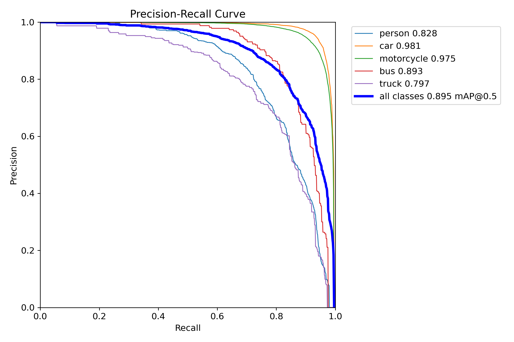
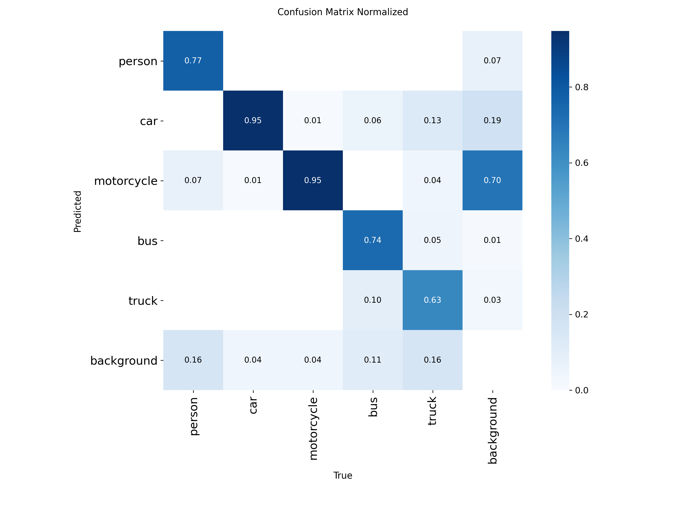
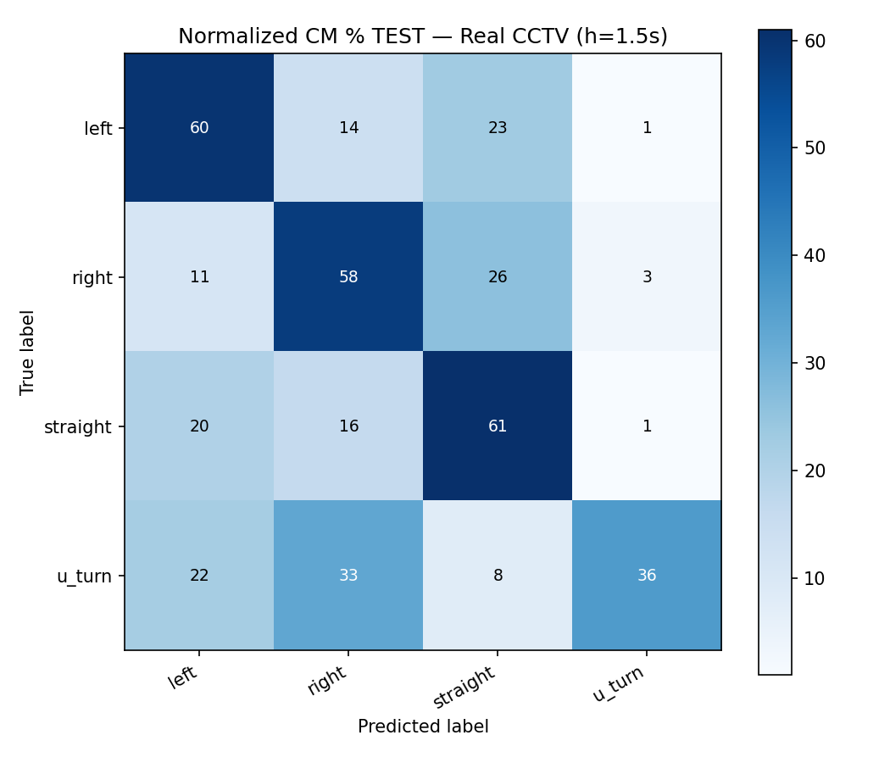
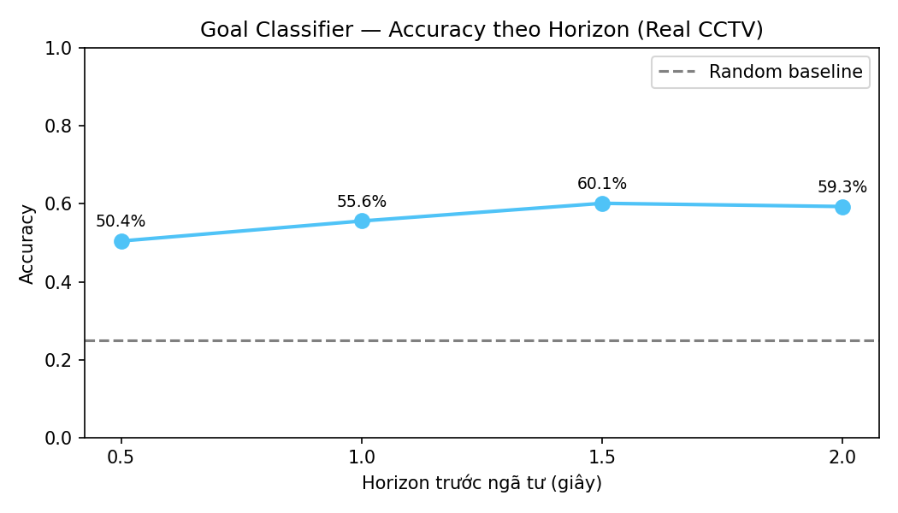
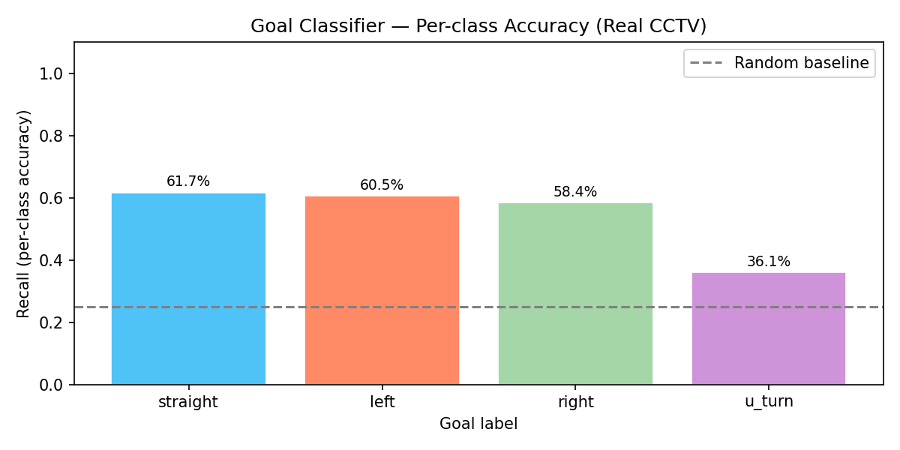

# CHƯƠNG 4. PHÂN TÍCH THIẾT KẾ, TRIỂN KHAI VÀ ĐÁNH GIÁ HỆ THỐNG

> Chương 3 đã trình bày các nền tảng lý thuyết và công nghệ được lựa chọn cho
> từng thành phần của hệ thống — YOLO11 cho phát hiện, ByteTrack cho theo dõi
> trong một camera (UC1), hệ luật suy diễn cho phát hiện vi phạm (UC2), Gradient
> Boosting có hiệu chỉnh xác suất kết hợp Kalman Filter cho dự đoán hướng đi,
> OpenStreetMap/SUMO/OpenDRIVE cho mạng lưới đường thực tế (UC3), và
> FastAPI/React/Leaflet cho lớp dịch vụ thời gian thực và cấu hình (UC4).
> Chương 4 đi từ các lựa chọn đó sang quá trình thiết kế và triển khai cụ thể:
> mục 4.1 trình bày kiến trúc tổng thể; mục 4.2 đi vào thiết kế chi tiết (giao
> diện, lớp, cấu trúc dữ liệu); mục 4.3 trình bày công cụ triển khai và kết quả
> đạt được trên dữ liệu thật; mục 4.4 tổng hợp công tác kiểm thử; mục 4.5 mô tả
> việc triển khai và vận hành thử trên video CCTV thật.

---

## 4.1 Phân tích và lựa chọn kiến trúc

### 4.1.1 Lựa chọn kiến trúc tổng thể

Hệ thống được tách thành ba lớp triển khai độc lập: **AI Pipeline**
(`custom_tracking_system/`), **Backend Server** (`server/`, FastAPI) và
**Frontend** (`frontend/`, React). Lý do tách AI Pipeline thành một thành
phần có thể chạy độc lập (qua `main.py`, không cần khởi động server) là để
đáp ứng đồng thời hai nhu cầu khác nhau: (1) chạy tích hợp trong server qua
một tiến trình nền (`server/services/ai_processor.py`) để phục vụ giao diện
giám sát thời gian thực — đúng yêu cầu phi chức năng "giao diện vận hành thời
gian thực qua web" (mục 2.4); và (2) chạy độc lập, không qua server, để phục
vụ đánh giá định lượng từng mô-đun mà không cần dựng toàn bộ hạ tầng web —
cách này được dùng trực tiếp để đo các kết quả ở mục 4.3.2.

Nguồn video được trừu tượng hoá qua một lớp cơ sở chung `VideoSource`, với
các lớp con cụ thể: `RTSPVideoSource`, `FileVideoSource`, `WebcamVideoSource`
(và `CARLAVideoSource` chỉ dùng cho kiểm thử nội bộ có kiểm soát). Việc trừu
tượng hoá này hiện thực hoá trực tiếp yêu cầu "khả năng độc lập nguồn camera"
(mục 2.4): các mô-đun xử lý phía sau (phát hiện, theo dõi, dự đoán...) chỉ làm
việc với một luồng khung hình chung, không quan tâm khung hình đó đến từ
camera IP, file video hay simulator. Trong phạm vi triển khai thực tế của đề
tài, `RTSPVideoSource`/`FileVideoSource` là nguồn dùng để chạy trên video CCTV
thật (mục 4.5); nguồn mô phỏng CARLA chỉ là một lựa chọn nguồn video cho mục
đích kiểm thử nội bộ, kết quả đo trên nguồn này không được trình bày như kết
quả hệ thống thật.

Hình 4.1 minh hoạ kiến trúc thành phần (component) tổng thể, còn Hình 4.2 minh
hoạ luồng xử lý của hệ thống trong phạm vi **một khung hình** — đơn vị xử lý
lặp lại liên tục trong suốt quá trình giám sát.

**Hình 4.1: Sơ đồ thành phần — kiến trúc tổng thể hệ thống**

**Hình 4.2: Sơ đồ hoạt động — luồng xử lý một khung hình qua toàn bộ pipeline AI**

### 4.1.2 Thiết kế tổng quan

Hình 4.3 trình bày sơ đồ gói (package), thể hiện kiến trúc phân tầng của hệ
thống thành bốn lớp: lớp **giao diện** (Presentation, `frontend/` — React +
Vite, gồm `Dashboard.jsx`, `MapView.jsx`, `AlertManagement.jsx` và các thành
phần con `CameraGrid`/`CameraFeed`, `IncidentPanel`); lớp **dịch vụ** (Service,
`server/` — FastAPI, gồm các router REST/WebSocket/MJPEG,
`services/ai_processor.py` chạy AI pipeline trong một luồng nền, các service
quản lý camera/alert/tracking/stream, và `models/database.py` qua SQLAlchemy);
lớp **AI/ML** (`custom_tracking_system/modules/`, chia theo từng nhóm chức năng
đã trình bày ở Chương 3: phát hiện/theo dõi trong một camera, phát hiện vi
phạm, dự đoán hướng rẽ + suy diễn hành trình, nguồn video/hiệu chỉnh camera);
và lớp **dữ liệu/bên ngoài** (bản đồ mạng lưới đường + trọng số mô hình +
SQLite + nguồn camera). Việc phân tầng theo chiều này cho phép thay đổi một
lớp (ví dụ đổi mô hình phát hiện, hoặc thêm một loại nguồn video mới) mà không
ảnh hưởng tới các lớp khác — trực tiếp đáp ứng yêu cầu "khả năng mở rộng số
lượng camera" và "khả năng độc lập nguồn camera" đã đặt ra ở mục 2.4.

**Hình 4.3: Sơ đồ gói (package) — kiến trúc phân tầng của hệ thống**

### 4.1.3 Thiết kế chi tiết gói — các lớp chính

Hình 4.4 trình bày sơ đồ lớp rút gọn của lõi AI Pipeline, chỉ giữ các lớp
quan trọng nhất tương ứng với từng use case đã đặc tả ở Chương 2:
`ByteTrackWrapper` (UC1 — theo dõi trong một camera), `IncidentDetector` (UC2
— phát hiện vi phạm vượt đèn đỏ/vượt vạch dừng/đi sai làn theo hệ luật),
`GoalClassifier` (UC3 — dự đoán hướng rẽ) và `RoutePredictor` (UC3 — suy diễn
hành trình nhiều ngã tư, kết hợp với `GeoReference` để quy đổi toạ độ thực).

**Hình 4.4: Sơ đồ lớp (rút gọn) — các lớp chính của lõi AI Pipeline**

---

## 4.2 Thiết kế chi tiết

### 4.2.1 Thiết kế giao diện

Giao diện vận hành (`frontend/`) tổ chức quanh ba khu vực chính, đúng theo UC2
(hiển thị vi phạm), UC3 (vẽ hành trình lên bản đồ) và UC4 (cấu hình): (1) một
lưới camera (`CameraGrid`/`CameraFeed`) hiển thị đồng thời luồng MJPEG đã chú
giải (bounding box, ID, nhãn lớp) từ nhiều camera; (2) một bảng cảnh báo
(`AlertManagement`/`IncidentPanel`) liệt kê các vi phạm theo thời gian thực,
cho phép xác nhận/bỏ qua; (3) một bản đồ (`MapView`, Leaflet + nền
OpenStreetMap) vẽ vị trí hiện tại và các hành trình dự đoán dạng polyline,
phân biệt độ đậm/nhạt theo mức tin cậy — hiện thực hoá trực tiếp yêu cầu "tính
minh bạch của dự đoán" (mục 2.4). Ba khu vực này cùng cập nhật qua một kết nối
WebSocket chung, giữ đồng bộ giữa luồng video, danh sách vi phạm và bản đồ mà
không cần người vận hành làm mới trang.

Hình 4.5 minh hoạ dashboard đang chạy thật trên video CCTV Phố Huế – Trần
Khát Chân (mục 4.5): luồng camera đã chú giải (bounding box, ID, nhãn lớp,
quỹ đạo gần nhất) ở giữa, danh sách cảnh báo thời gian thực ở bên phải.

**Hình 4.5: Dashboard giám sát đa camera, chạy thật trên video Phố Huế – Trần Khát Chân**

### 4.2.2 Thiết kế lớp

Hình 4.6 minh hoạ luồng tương tác xuyên suốt nhiều lớp cho nghiệp vụ trọng tâm
UC3: từ quỹ đạo theo dõi của một phương tiện → dự đoán hướng rẽ (GoalClassifier)
→ suy diễn hành trình nhiều ngã tư trên đồ thị giao lộ (RoutePredictor) → vẽ
lên bản đồ thực (MapView).

**Hình 4.6: Sơ đồ tuần tự — dự đoán hướng đi dài hạn → vẽ hành trình lên bản đồ (UC3)**

Bảng 4.1 tóm tắt thuộc tính/phương thức chính của các lớp chủ đạo trong sơ đồ
lớp (Hình 4.4).

**Bảng 4.1: Thuộc tính và phương thức chính của các lớp chủ đạo**

| Lớp | Thuộc tính chính | Phương thức chính |
|---|---|---|
| `ByteTrackWrapper` | `tracker` (instance ByteTrack qua `boxmot`), `camera_id` | `update(detections, frame)` |
| `IncidentDetector` | (nội bộ: cấu hình ROI/vạch dừng/làn theo camera, trạng thái cooldown theo loại vi phạm × đối tượng) | `update(tracks, cam, pred, rois)` |
| `GoalClassifier` | `model` (GradientBoosting đã hiệu chỉnh), `feature_names` | `update_and_predict(track_id, box, cls, ts)` → `{direction, probabilities, confidence}` |
| `RoutePredictor` | `junction_graph` | `predict(x, y, heading, direction, n_hops)`, `predict_probabilistic(...)` |

### 4.2.3 Cấu trúc dữ liệu

Hai nhóm cấu trúc dữ liệu chính được dùng trong hệ thống: cấu trúc **trong bộ
nhớ** (in-memory, phục vụ xử lý thời gian thực) và cấu trúc **lưu trữ bền**
(persistent, SQLite, phục vụ tra cứu lại). Ở nhóm trong bộ nhớ, mỗi track cục
bộ (`Track`) giữ `track_id`, khung bao hiện tại và lịch sử vị trí/vận tốc gần
nhất; mạng lưới đường thực tế được nạp một lần khi khởi động dưới dạng đồ thị
giao lộ (`junction_graph.json` — nút là giao lộ với toạ độ thực, cạnh là đoạn
đường với chiều dài/hướng), minh hoạ ở Hình 4.7 cho khu vực Phố Huế – Trần
Khát Chân (101 giao lộ, 742 đoạn đường) dùng trong demo thực tế ở mục 4.5.

**Hình 4.7: Đồ thị giao lộ xây dựng từ OpenStreetMap cho khu vực Phố Huế – Trần Khát Chân (101 giao lộ, 742 đoạn đường)**

Ở nhóm lưu trữ bền, cơ sở dữ liệu SQLite (`tracking_system.db`, quản lý qua
SQLAlchemy [1]) gồm 5 bảng, tóm tắt ở Bảng 4.2.

**Bảng 4.2: Cấu trúc cơ sở dữ liệu (SQLite, 5 bảng)**

| Bảng | Vai trò | Trường chính |
|---|---|---|
| `cameras` | Thông tin/cấu hình từng camera | `id`, vị trí (x,y,z)/góc (pitch,yaw,roll), độ phân giải, FOV, fps, `status` |
| `alerts` | Vi phạm/sự cố đã phát sinh | `type`, `severity`, `track_id`, `camera_id`, `message`, `snapshot_path`/`clip_path`, `status` (new/acknowledged/resolved) |
| `tracked_objects` | Đối tượng đang theo dõi | `track_id`, `object_class`, `first_seen`/`last_seen`, `status` |
| `tracking_history` | Lịch sử vị trí theo thời gian của mỗi đối tượng | `track_id`, `camera_id`, `frame_number`, khung bao, `center_x`/`center_y`, `confidence`, `timestamp` |
| `rois` | Vùng quan tâm cấu hình theo camera (UC4) | `camera_id`, `polygon` (JSON toạ độ), `alert_types`, `is_active` |

Các trường request/response qua API được mô tả riêng bằng schema Pydantic
[2], tách biệt khỏi cấu trúc lưu trữ ORM để có thể thay đổi định dạng trả về
cho client mà không ảnh hưởng đến cấu trúc bảng trong cơ sở dữ liệu.

---

## 4.3 Triển khai

### 4.3.1 Thư viện và công cụ sử dụng

Bảng 4.3 tổng hợp các thư viện/công cụ chính, theo từng thành phần triển
khai, trích từ `requirements.txt` của AI Pipeline và Backend Server, và
`package.json` của Frontend.

**Bảng 4.3: Thư viện và công cụ chính theo thành phần**

| Thành phần | Thư viện/công cụ | Vai trò |
|---|---|---|
| AI Pipeline | `torch`/`torchvision` 2.4.1 | Nền tảng tính toán mạng nơ-ron |
| AI Pipeline | `ultralytics` ≥ 8.3 | YOLO11 — phát hiện đối tượng |
| AI Pipeline | `boxmot` ≥ 20.0 | ByteTrack — theo dõi trong một camera |
| AI Pipeline | `scikit-learn` ≥ 1.7 | Gradient Boosting + hiệu chỉnh xác suất (Goal Classifier) |
| AI Pipeline | `opencv-python`, `numpy`, `scipy`, `pandas` | Xử lý ảnh/số liệu nền tảng |
| AI Pipeline | `motmetrics` ≥ 1.4 (py-motmetrics) | Đánh giá MOTA/IDF1 (mục 4.4, Chương 5) |
| Backend Server | `fastapi`, `uvicorn[standard]` | REST API, WebSocket, MJPEG streaming |
| Backend Server | `sqlalchemy` ≥ 2.0 | ORM cho SQLite |
| Backend Server | `pydantic` ≥ 2.0 | Schema request/response, kiểm tra dữ liệu vào/ra |
| Frontend | `react`, `react-dom`, `react-router-dom` | Giao diện người dùng |
| Frontend | `leaflet` | Bản đồ tương tác (MapView) |
| Frontend | `recharts` | Biểu đồ thống kê trên dashboard |
| Frontend | `vite`, `tailwindcss` | Build/dev server, styling |

### 4.3.2 Kết quả đạt được

Bảng 4.4 thống kê quy mô sản phẩm cuối; Bảng 4.5 tổng hợp kết quả định lượng
của các mô hình học máy chính, đo trên dữ liệu thật (không dùng dữ liệu mô
phỏng CARLA).

**Bảng 4.4: Thống kê sản phẩm**

| Thông số | Giá trị |
|---|---|
| Số file Python (AI Pipeline) | 167 |
| Số mô-đun lõi (`modules/`) | 19 |
| Số file Backend (FastAPI) | 23 |
| Số file Frontend (React) | 16 |
| Dung lượng mô hình phát hiện `yolo11s_vn.pt` | 19 MB |
| Dung lượng mô hình dự đoán `goal_classifier_real.pkl` | 4,7 MB |
| Số lớp đối tượng phát hiện | 5 (người, ô tô, xe máy, xe buýt, xe tải) |
| Dữ liệu huấn luyện phát hiện | 15.957 ảnh auto-label / 623.329 khung bao |
| Dữ liệu Goal Classifier | 5.332 track (train) / 1.334 track (test) |
| Đồ thị giao lộ (Phố Huế – Trần Khát Chân) | 101 giao lộ / 742 đoạn đường |

**Bảng 4.5: Kết quả định lượng các mô hình chính (đo trên dữ liệu thật)**

| Mô hình | Tập đánh giá | Kết quả chính |
|---|---|---|
| YOLO11s_vn (phát hiện, 5 lớp giao thông VN) | 800 ảnh lấy mẫu ngẫu nhiên từ pool 15.957 ảnh auto-label (đã spot-check tay, xem dưới) | mAP50 = 89,5%, mAP50-95 = 77,0% |
| Goal Classifier (real-world, horizon = 1,5s) | Test set track thật, tách riêng khỏi train (5.332 train / 1.334 test) | Accuracy = 60,12%, Balanced accuracy = 54,18%, ECE = 0,101 |

Lưu ý quan trọng về độ tin cậy của từng số liệu: nhãn auto-label dùng huấn
luyện YOLO11s_vn đã qua spot-check thủ công (120 ảnh grid đại diện, 1
ảnh/video nguồn trong 124 video, kết luận >85% bbox hợp lệ — xem
`docs/qa_auto_label.md`), không phải "chưa qua hand-verify" hoàn toàn; tuy
nhiên đây là spot-check theo mẫu đại diện, không phải xác minh từng box trong
toàn bộ 15.957 ảnh/623.329 box. Caveat quan trọng hơn nằm ở cách đo mAP: vì
không lưu lại val split gốc từ lúc huấn luyện, mAP50/mAP50-95 ở trên được đo
lại bằng cách lấy ngẫu nhiên 800 ảnh **từ chính pool dữ liệu đã dùng để huấn
luyện**, không phải một tập kiểm thử độc lập (held-out). Số liệu này do đó có
thể lạc quan hơn hiệu năng tổng quát hoá thật, và là một phần việc còn thiếu
đã nêu ở Chương 6. Ngược lại, kết quả Goal Classifier được đo trên track thật
tách bạch rõ giữa tập huấn luyện và tập kiểm thử (honest test set), nên phản
ánh đúng hơn năng lực tổng quát hoá.

Chất lượng mô hình phát hiện còn được trực quan hoá qua đường cong
Precision-Recall (Hình 4.9) và ma trận nhầm lẫn (Hình 4.10). Hình 4.8 minh
hoạ kết quả phát hiện trên một batch ảnh validation thật.

**Hình 4.8: Kết quả phát hiện đối tượng của YOLO11s_vn trên một batch ảnh validation thật**

**Hình 4.9: Đường cong Precision-Recall của mô hình phát hiện YOLO11s_vn**

**Hình 4.10: Ma trận nhầm lẫn các lớp đối tượng của YOLO11s_vn**

Với mô-đun dự đoán hướng đi (Goal Classifier — UC3), Hình 4.11 trình bày ma
trận nhầm lẫn bốn hướng (đi thẳng/rẽ trái/rẽ phải/quay đầu); Hình 4.12 thể
hiện độ chính xác theo từng khoảng dự đoán (horizon) — cho thấy horizon 1,5s
là điểm cân bằng tốt nhất; Hình 4.13 thể hiện độ chính xác theo từng lớp
hướng, trong đó lớp "quay đầu" (u_turn) khó nhất do hiếm và dễ nhầm với rẽ.

**Hình 4.11: Ma trận nhầm lẫn của Goal Classifier (4 hướng: thẳng/trái/phải/quay đầu)**

**Hình 4.12: Độ chính xác của Goal Classifier theo từng khoảng dự đoán (horizon)**

**Hình 4.13: Độ chính xác của Goal Classifier theo từng lớp hướng đi**

*(Lưu ý: đường cong Loss/mAP theo epoch của YOLO11s_vn không được trình bày do
nhật ký huấn luyện gốc (`results.csv`) không được lưu lại; phần đánh giá chất
lượng theo dõi của ByteTrack — MOTA/IDF1 — được trình bày ở mục 4.4 và Chương
5 vì cần ground-truth track gán nhãn tay trên video thật.)*

### 4.3.3 Minh hoạ chức năng chính trên sản phẩm chạy thực tế

Phần này minh hoạ sản phẩm cuối đang chạy trực tiếp trên video CCTV thật tại
giao lộ Phố Huế – Trần Khát Chân, theo đúng ba use case chức năng.

Hình 4.14 minh hoạ **UC1 (phát hiện và theo dõi)**: mỗi phương tiện được phát
hiện, gán khung bao kèm nhãn lớp và một định danh theo dõi (track ID) duy trì
ổn định qua các khung hình — thể hiện khả năng xử lý đồng thời mật độ xe máy
rất cao đặc trưng giao thông Việt Nam.

**Hình 4.14: UC1 — Phát hiện và theo dõi phương tiện (kèm track ID) trên video CCTV thật Phố Huế – Trần Khát Chân**

Hình 4.15 minh hoạ **UC2 (phát hiện vi phạm)**: hệ thống vẽ các vùng làn được
cấu hình (làn ô tô/xe buýt/xe tải — viền xanh lá; làn xe máy — viền xanh
dương) và vạch dừng đèn đỏ (viền đỏ); các phương tiện đi sai làn (ví dụ xe máy
lấn vào làn ô tô) được tô đỏ kèm nhãn "SAI LÀN".

**Hình 4.15: UC2 — Phát hiện vi phạm đi sai làn (vùng làn + vạch dừng đèn đỏ được cấu hình theo camera, xe vi phạm tô đỏ) trên video CCTV thật**

Hình 4.16 minh hoạ **UC3 (dự đoán hướng di chuyển)**: hành trình dự đoán của
phương tiện được suy diễn trên đồ thị giao lộ và vẽ lên nền bản đồ thực
OpenStreetMap, kèm danh sách đối tượng đang theo dõi. Hình 4.17 minh hoạ giao
diện quản lý vi phạm (UC2) với bảng cảnh báo theo thời gian thực, lọc theo mức
độ/camera.

**Hình 4.16: UC3 — Hành trình dự đoán vẽ trên nền bản đồ thực OpenStreetMap khu vực Phố Huế – Trần Khát Chân**

**Hình 4.17: UC2 — Giao diện quản lý vi phạm, chạy thật trên video Phố Huế – Trần Khát Chân**

*(Lưu ý: mật độ cảnh báo cao trong Hình 4.17 đến từ các loại cảnh báo sự cố mà
ngưỡng chưa được hiệu chỉnh riêng cho camera Phố Huế — hướng hoàn thiện được
nêu ở Chương 6, không phải lỗi hiển thị của giao diện.)*

## 4.4 Kiểm thử

Công tác kiểm thử được thực hiện theo ba nhóm, tương ứng ba loại đầu ra của
hệ thống. Thứ nhất, dữ liệu auto-label dùng để huấn luyện YOLO11s_vn đã qua
kiểm tra định dạng và spot-check thủ công trước khi đưa vào huấn luyện
(`docs/qa_auto_label.md`), nhằm tránh nhãn lỗi làm sai lệch kết quả huấn
luyện. Thứ hai, các mô hình học máy (YOLO11s_vn, Goal Classifier) được đánh
giá định lượng trên tập kiểm thử tách riêng khỏi tập huấn luyện, kết quả tổng
hợp ở Bảng 4.5 và các Hình 4.9–4.13. Thứ ba, chất lượng theo dõi (tracking)
của ByteTrack được đánh giá bằng chỉ số MOTA/IDF1 theo chuẩn CLEAR-MOT [3] qua
thư viện `py-motmetrics` — vì việc đo MOTA/IDF1 cần ground-truth track đồng bộ
theo từng khung hình (đang được gán nhãn bán tự động trên video CCTV thật Phố
Huế), nội dung và kết quả chi tiết của phần đánh giá này được trình bày riêng ở
Chương 5 cùng với phân tích nguyên nhân, để giữ Chương 4 tập trung vào kết quả
đo trực tiếp trên dữ liệu thật.

## 4.5 Triển khai

Hệ thống được triển khai và vận hành thử trực tiếp trên video CCTV thật tại
giao lộ Phố Huế – Trần Khát Chân (Hà Nội) — Hình 4.18. Quy trình triển khai
gồm ba bước: (1) xây dựng mạng lưới đường thực tế cho khu vực này từ
OpenStreetMap (Hình 4.7, mục 4.2.3); (2) hiệu chỉnh camera bằng phương pháp
khớp trực quan đã trình bày ở mục 3.5 — chiếu mạng lưới đường lên một khung
hình của video rồi tinh chỉnh vị trí/góc nghiêng/FOV camera bằng mắt cho tới
khi khớp với đường thật trong ảnh (Hình 4.19); (3) chạy pipeline đầy đủ
(YOLO11s_vn → ByteTrack → phát hiện vi phạm theo hệ luật → Goal Classifier +
Route Predictor trên bản đồ Phố Huế) trên video, kèm cấu hình ROI/vạch
dừng/làn/chu kỳ đèn theo camera (UC4).

**Hình 4.18: Khung hình thực tế từ video CCTV tại giao lộ Phố Huế – Trần Khát Chân**

**Hình 4.19: Hiệu chỉnh camera — chiếu mạng lưới đường thực tế (từ OpenStreetMap) lên khung hình video để khớp vị trí/góc camera bằng mắt**

Hình 4.20 trình bày sơ đồ triển khai vật lý: toàn bộ AI Pipeline, Backend
Server và bản build tĩnh của Frontend chạy trên một máy duy nhất (cấu hình
demo: Windows, GPU RTX 4060 8GB), không yêu cầu hạ tầng máy chủ chuyên dụng —
đúng yêu cầu phi chức năng "hiệu năng thời gian thực... không yêu cầu phần
cứng máy chủ chuyên dụng" (mục 2.4). Để đáp ứng mục tiêu ~15–20 FPS khi xử lý
nhiều luồng, pipeline áp dụng phát hiện theo lô (batch detection) cho các
camera và điều tiết tần suất các bước nặng (mục 3.6).

**Hình 4.20: Sơ đồ triển khai (deployment) hệ thống**

Việc vận hành thử này đã được kiểm tra đầu-cuối (script chạy không lỗi, vị trí
thế giới hợp lý, phát hiện vi phạm và hành trình dự đoán hiển thị đúng trên bản
đồ thật), với các khung hình minh hoạ ở mục 4.3.3 (Hình 4.14–4.17).

---

Chương này đã trình bày kiến trúc tổng thể, thiết kế chi tiết, công cụ triển
khai và kết quả đo được trên dữ liệu thật của hệ thống, cùng với việc vận
hành thử trực tiếp trên video CCTV thật tại giao lộ Phố Huế – Trần Khát Chân.
Các con số ở Bảng 4.5 và các hình minh hoạ sản phẩm chạy thực tế (Hình
4.14–4.17) cho thấy hệ thống đã hoạt động được trên dữ liệu thật ở mức có thể
chấp nhận cho một sản phẩm thử nghiệm, nhưng vẫn còn khoảng cách tới một hệ
thống sẵn sàng vận hành thực tế quy mô lớn. Chương 5 sẽ đi sâu vào các vấn đề
cụ thể đã phát hiện trong quá trình xây dựng từng thành phần, giải pháp đã áp
dụng và kết quả định lượng trước/sau khi áp dụng giải pháp đó.

---

## TÀI LIỆU THAM KHẢO (Chương 4)

[1] Michael Bayer, "SQLAlchemy — The Database Toolkit for Python." [Online].
Available: https://www.sqlalchemy.org/ (truy cập 06/2026).

[2] S. Colvin et al., "Pydantic — Data Validation Using Python Type Hints."
[Online]. Available: https://docs.pydantic.dev/ (truy cập 06/2026).

[3] K. Bernardin, R. Stiefelhagen, "Evaluating Multiple Object Tracking
Performance: The CLEAR MOT Metrics," *EURASIP Journal on Image and Video
Processing*, vol. 2008, article 246309, 2008.
