# CHƯƠNG 4. PHÂN TÍCH THIẾT KẾ, TRIỂN KHAI VÀ ĐÁNH GIÁ HỆ THỐNG

> Chương 3 đã trình bày các nền tảng lý thuyết và công nghệ được lựa chọn cho
> từng thành phần của hệ thống — YOLO11 cho phát hiện, ByteTrack cho theo dõi
> trong một camera, OSNet cho nhận diện lại xuyên camera, hệ luật suy diễn cho
> phát hiện sự cố, Gradient Boosting có hiệu chỉnh xác suất kết hợp Kalman
> Filter cho dự đoán hành vi, OpenStreetMap/SUMO/OpenDRIVE cho mạng lưới đường
> thực tế, và FastAPI/React/Leaflet cho lớp dịch vụ thời gian thực. Chương 4 đi
> từ các lựa chọn đó sang quá trình thiết kế và triển khai cụ thể: mục 4.1
> trình bày kiến trúc tổng thể; mục 4.2 đi vào thiết kế chi tiết (giao diện,
> lớp, cấu trúc dữ liệu); mục 4.3 trình bày công cụ triển khai và kết quả đạt
> được trên dữ liệu thật; mục 4.4 tổng hợp công tác kiểm thử; mục 4.5 mô tả
> việc triển khai và vận hành thử trên video CCTV thật.

---

## 4.1 Phân tích và lựa chọn kiến trúc

### 4.1.1 Lựa chọn kiến trúc tổng thể

Hệ thống được tách thành ba lớp triển khai độc lập: **AI Pipeline**
(`custom_tracking_system/`), **Backend Server** (`server/`, FastAPI) và
**Frontend** (`frontend/`, React). Lý do tách AI Pipeline thành một thành
phần có thể chạy độc lập (qua `main.py`, không cần khởi động server) là để
đáp ứng đồng thời hai nhu cầu khác nhau: (1) chạy tích hợp trong server qua
một tiến trình nền (`server/services/ai_processor.py`) để phục vụ giao diện
giám sát thời gian thực — đúng yêu cầu phi chức năng "giao diện vận hành thời
gian thực qua web" (mục 2.4); và (2) chạy độc lập, không qua server, để phục
vụ đánh giá định lượng từng mô-đun (ví dụ đo MOTA/IDF1 hay xuất dữ liệu eval)
mà không cần dựng toàn bộ hạ tầng web — cách này được dùng trực tiếp để đo các
kết quả ở mục 4.3.2.

Nguồn video được trừu tượng hoá qua một lớp cơ sở chung `VideoSource`, với
bốn lớp con cụ thể: `CARLAVideoSource`, `RTSPVideoSource`, `FileVideoSource`,
`WebcamVideoSource` (cùng một `CARLABridgeClient` cho chế độ kết nối CARLA
qua tiến trình cầu nối riêng — cần thiết vì CARLA 0.9.14 chỉ tương thích
Python 3.7, trong khi AI Pipeline chạy Python 3.10). Việc trừu tượng hoá này
hiện thực hoá trực tiếp yêu cầu "khả năng độc lập nguồn camera" (mục 2.4): các
mô-đun xử lý phía sau (phát hiện, theo dõi, ReID, dự đoán...) chỉ làm việc với
một luồng khung hình chung, không quan tâm khung hình đó đến từ camera IP, file
video hay simulator. Trong phạm vi triển khai thực tế của đề tài,
`RTSPVideoSource`/`FileVideoSource` là nguồn dùng để chạy trên video CCTV
thật (mục 4.5); `CARLAVideoSource` được giữ lại như một nguồn dữ liệu phục vụ
kiểm thử nội bộ có kiểm soát (có ground-truth tự sinh từ simulator) — kết quả
đo trên nguồn này không được trình bày như kết quả hệ thống thật, chỉ dùng làm
chẩn đoán hỗ trợ ở Chương 5.

Hình 4.1 minh hoạ kiến trúc thành phần (component) tổng thể, còn Hình 4.2 minh
hoạ luồng xử lý của hệ thống trong phạm vi **một khung hình** — đơn vị xử lý
lặp lại liên tục trong suốt quá trình giám sát.

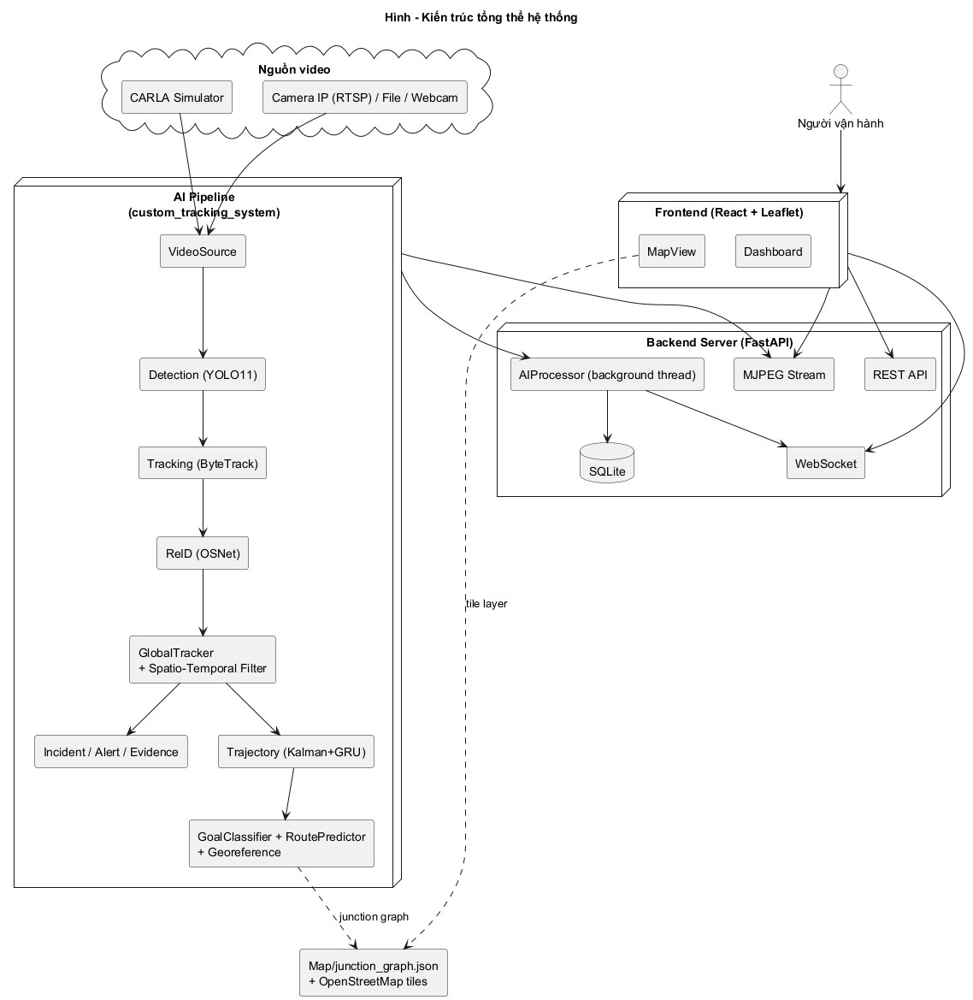

**Hình 4.1: Sơ đồ thành phần — kiến trúc tổng thể hệ thống**

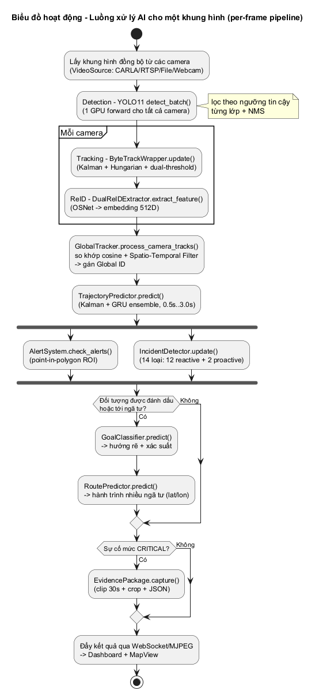

**Hình 4.2: Sơ đồ hoạt động — luồng xử lý một khung hình qua toàn bộ pipeline AI**

### 4.1.2 Thiết kế tổng quan

Hình 4.3 trình bày sơ đồ gói (package), thể hiện kiến trúc phân tầng của hệ
thống thành bốn lớp: lớp **giao diện** (Presentation, `frontend/` — React +
Vite, gồm `Dashboard.jsx`, `MapView.jsx`, `AlertManagement.jsx` và các thành
phần con `CameraGrid`/`CameraFeed`, `IncidentPanel`/`ScenarioPanel`); lớp
**dịch vụ** (Service, `server/` — FastAPI, gồm các router REST/WebSocket/MJPEG,
`services/ai_processor.py` chạy AI pipeline trong một luồng nền, các service
quản lý camera/alert/tracking/stream, và `models/database.py` qua SQLAlchemy);
lớp **AI/ML** (`custom_tracking_system/modules/`, chia theo từng nhóm chức năng
đã trình bày ở Chương 3: phát hiện/theo dõi/ReID, theo dõi xuyên camera, dự
đoán quỹ đạo, dự đoán hướng rẽ + suy diễn hành trình, phát hiện sự cố/cảnh
báo/đóng gói bằng chứng, nguồn video/hiệu chỉnh camera); và lớp **dữ liệu/bên
ngoài** (bản đồ mạng lưới đường + trọng số mô hình + SQLite + nguồn camera).
Việc phân tầng theo chiều này cho phép thay đổi một lớp (ví dụ đổi mô hình
phát hiện, hoặc thêm một loại nguồn video mới) mà không ảnh hưởng tới các lớp
khác — trực tiếp đáp ứng yêu cầu "khả năng mở rộng số lượng camera" và "khả
năng độc lập nguồn camera" đã đặt ra ở mục 2.4.

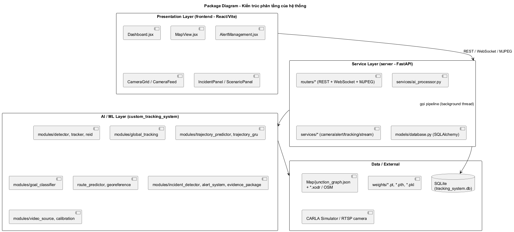

**Hình 4.3: Sơ đồ gói (package) — kiến trúc phân tầng của hệ thống**

### 4.1.3 Thiết kế chi tiết gói — các lớp chính

Hình 4.4 trình bày sơ đồ lớp rút gọn của lõi AI Pipeline, chỉ giữ các lớp
quan trọng nhất tương ứng với từng use case đã đặc tả ở Chương 2: `GlobalTracker`
(UC2 — theo dõi xuyên camera), `ByteTrackWrapper` (UC1.2 — theo dõi trong một
camera), `DualReIDExtractor` (UC1.3 — trích đặc trưng định danh, kế thừa từ
`ReIDExtractor` để dùng hai nhánh mô hình OSNet riêng cho người và phương
tiện), `IncidentDetector` (UC3.1 — phát hiện sự cố tự động), `GoalClassifier`
(UC4.1 — dự đoán hướng rẽ) và `RoutePredictor` (UC4.2 — suy diễn hành trình
nhiều ngã tư, kết hợp với `GeoReference` để quy đổi toạ độ thực).

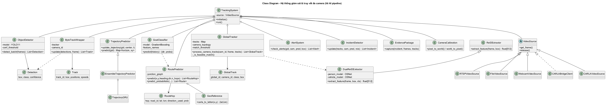

**Hình 4.4: Sơ đồ lớp (rút gọn) — các lớp chính của lõi AI Pipeline**

---

## 4.2 Thiết kế chi tiết

### 4.2.1 Thiết kế giao diện

Giao diện vận hành (`frontend/`) tổ chức quanh ba khu vực chính, đúng theo
UC5 (giám sát qua dashboard) và UC4.3 (vẽ hành trình lên bản đồ): (1) một
lưới camera (`CameraGrid`/`CameraFeed`) hiển thị đồng thời luồng MJPEG đã chú
giải (bounding box, ID, nhãn lớp) từ nhiều camera; (2) một bảng cảnh báo
(`AlertManagement`/`IncidentPanel`) liệt kê các sự cố theo thời gian thực,
cho phép xác nhận/bỏ qua và — đúng UC3.2 — chọn trực tiếp một đối tượng đang
hiển thị để đánh dấu "cần truy vết"; (3) một bản đồ (`MapView`, Leaflet + nền
OpenStreetMap) vẽ vị trí hiện tại và các hành trình dự đoán dạng polyline,
phân biệt độ đậm/nhạt theo mức tin cậy — hiện thực hoá trực tiếp yêu cầu
"tính minh bạch của dự đoán" (mục 2.4). Ba khu vực này cùng cập nhật qua một
kết nối WebSocket chung, giữ đồng bộ giữa luồng video, danh sách cảnh báo và
bản đồ mà không cần người vận hành làm mới trang.

Hình 4.5 minh hoạ dashboard đang chạy thật trên video CCTV Phố Huế – Trần
Khát Chân (mục 4.5): luồng camera đã chú giải (bounding box, ID, nhãn lớp,
quỹ đạo gần nhất) ở giữa, danh sách cảnh báo thời gian thực ở bên phải.

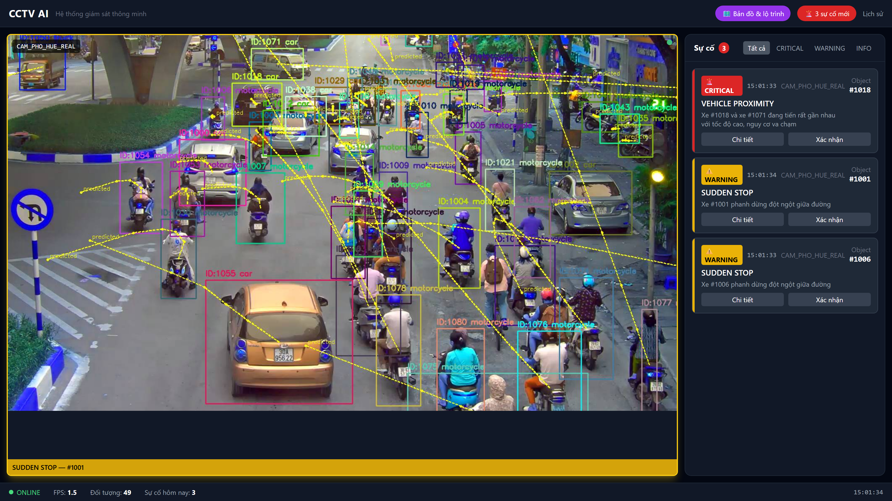

**Hình 4.5: Dashboard giám sát đa camera, chạy thật trên video Phố Huế – Trần Khát Chân**

### 4.2.2 Thiết kế lớp

Hình 4.6 và Hình 4.7 minh hoạ hai luồng tương tác xuyên suốt nhiều lớp, tương
ứng hai luồng nghiệp vụ quan trọng nhất đã giới thiệu ở mục 2.2.6: theo dõi
xuyên camera (UC1 → UC2), và đánh dấu đối tượng → suy diễn hành trình → vẽ
lên bản đồ (UC3.2 → UC4).

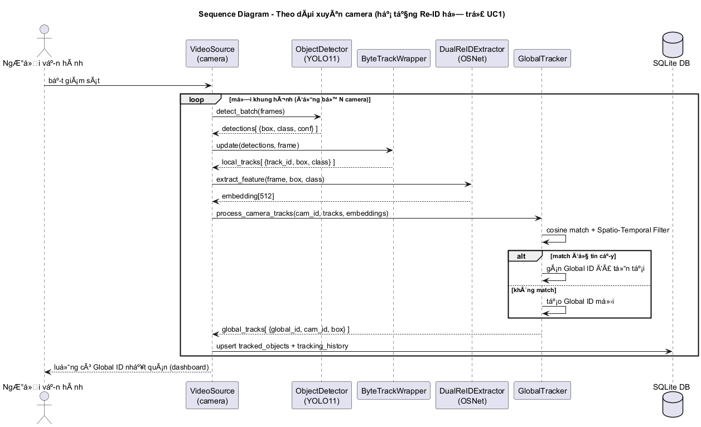

**Hình 4.6: Sơ đồ tuần tự — theo dõi xuyên camera (UC1 → UC2)**

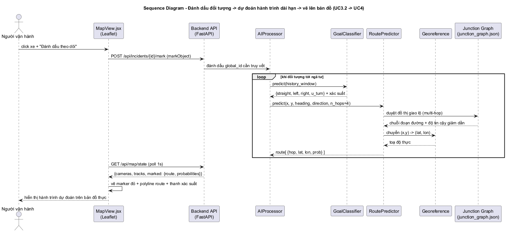

**Hình 4.7: Sơ đồ tuần tự — đánh dấu đối tượng → dự đoán hành trình dài hạn → vẽ lên bản đồ (UC3.2 → UC4)**

**Bổ sung 2026-06-26 — lưu ảnh khi đánh dấu.** Rà soát lại UC3.2 cho thấy hành
động đánh dấu (`mark_object()`) trước đó chỉ giữ một con trỏ `global_id` trong
bộ nhớ (RAM) của tiến trình AI, không lưu bất kỳ đặc điểm nào của đối tượng —
nếu đối tượng rời camera hoặc server khởi động lại, không còn cách nào "truy
quét lại" đúng đối tượng đã đánh dấu. Đã bổ sung: ngay khung hình tiếp theo
sau khi đánh dấu, hệ thống cắt một ảnh crop của đối tượng (lề 20px, cùng quy
ước với `EvidencePackage`), lưu vào `evidence/marked/marked_{global_id}.jpg`
và ghi đường dẫn vào `tracked_objects.marked_snapshot_path` (Bảng 4.2) — chỉ
lưu một lần mỗi lượt đánh dấu, đánh dấu lại sẽ ghi đè bằng ảnh mới. Một
endpoint mới `GET /api/tracks/{global_id}/snapshot` phục vụ lại ảnh này. Đây
là bước đầu cho việc lưu đặc điểm có thể tra cứu lại — biển số xe (nếu huấn
luyện thành công, xem Chương 6) là đặc điểm tiếp theo dự kiến bổ sung vào cùng
cơ chế này.

Bảng 4.1 tóm tắt thuộc tính/phương thức chính của các lớp chủ đạo trong sơ đồ
lớp (Hình 4.4).

**Bảng 4.1: Thuộc tính và phương thức chính của các lớp chủ đạo**

| Lớp | Thuộc tính chính | Phương thức chính |
|---|---|---|
| `GlobalTracker` | `tracks` (bảng tra Global ID), `camera_topology`, `match_threshold` | `process_camera_tracks(cam_id, frame, tracks)`, `_is_feasible_match()` (bộ lọc thời gian–không gian) |
| `ByteTrackWrapper` | `tracker` (instance ByteTrack qua `boxmot`), `camera_id` | `update(detections, frame)` |
| `DualReIDExtractor` | `person_model`, `vehicle_model` (hai OSNet riêng) | `extract_feature(frame, box, cls)` — định tuyến theo `cls` |
| `IncidentDetector` | (nội bộ: trạng thái cooldown theo loại sự cố × đối tượng) | `update(tracks, cam, pred, rois)` |
| `GoalClassifier` | `model` (GradientBoosting đã hiệu chỉnh), `feature_names` | `predict(history)` → `{direction, probabilities}` |
| `RoutePredictor` | `junction_graph` | `predict(x, y, heading, direction, n_hops)`, `predict_probabilistic(...)` |

### 4.2.3 Cấu trúc dữ liệu

Hai nhóm cấu trúc dữ liệu chính được dùng trong hệ thống: cấu trúc **trong bộ
nhớ** (in-memory, phục vụ xử lý thời gian thực) và cấu trúc **lưu trữ bền**
(persistent, SQLite, phục vụ tra cứu lại). Ở nhóm trong bộ nhớ, mỗi track cục
bộ (`Track`) giữ `track_id`, khung bao hiện tại và lịch sử vị trí/vận tốc gần
nhất; mỗi track toàn cục (`GlobalTrack`) thêm `global_id` dùng chung xuyên
camera; mạng lưới đường thực tế được nạp một lần khi khởi động dưới dạng đồ
thị giao lộ (`junction_graph.json` — nút là giao lộ với toạ độ thực, cạnh là
đoạn đường với chiều dài/hướng), minh hoạ ở Hình 4.8 cho khu vực Phố Huế –
Trần Khát Chân (101 giao lộ, 742 đoạn đường) dùng trong demo thực tế ở mục
4.5.

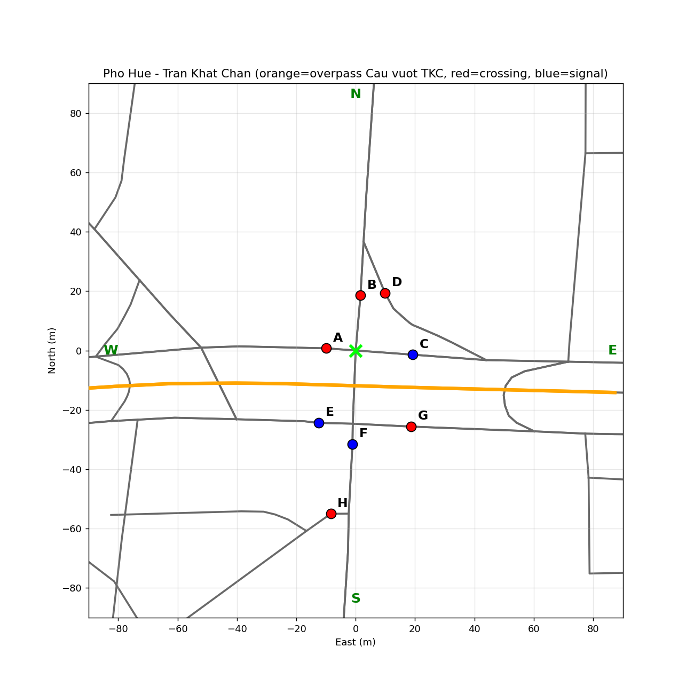

**Hình 4.8: Đồ thị giao lộ xây dựng từ OpenStreetMap cho khu vực Phố Huế – Trần Khát Chân (101 giao lộ, 742 đoạn đường)**

Ở nhóm lưu trữ bền, cơ sở dữ liệu SQLite (`tracking_system.db`, quản lý qua
SQLAlchemy [1]) gồm 5 bảng, tóm tắt ở Bảng 4.2.

**Bảng 4.2: Cấu trúc cơ sở dữ liệu (SQLite, 5 bảng)**

| Bảng | Vai trò | Trường chính |
|---|---|---|
| `cameras` | Thông tin/cấu hình từng camera | `id`, vị trí (x,y,z)/góc (pitch,yaw,roll), độ phân giải, FOV, fps, `status` |
| `alerts` | Cảnh báo/sự cố đã phát sinh | `type`, `severity`, `global_id`, `camera_id`, `message`, `snapshot_path`/`clip_path`, `status` (new/acknowledged/resolved) |
| `tracked_objects` | Đối tượng đã có Global ID | `global_id`, `object_class`, `first_seen`/`last_seen`, `total_cameras`, `status`, `marked_snapshot_path`/`marked_at` (ảnh crop chụp lúc đánh dấu — bổ sung 2026-06-26, xem mục 4.2.2) |
| `tracking_history` | Lịch sử vị trí theo thời gian của mỗi Global ID | `global_id`, `camera_id`, `frame_number`, khung bao, `center_x`/`center_y`, `confidence`, `timestamp` |
| `rois` | Vùng quan tâm cấu hình theo camera (UC6) | `camera_id`, `polygon` (JSON toạ độ), `alert_types`, `is_active` |

Các trường request/response qua API được mô tả riêng bằng schema Pydantic
[2], tách biệt khỏi cấu trúc lưu trữ ORM để có thể thay đổi định dạng trả về
cho client mà không ảnh hưởng đến cấu trúc bảng trong cơ sở dữ liệu.

---

## 4.3 Triển khai

### 4.3.1 Thư viện và công cụ sử dụng

Bảng 4.3 tổng hợp các thư viện/công cụ chính, theo từng thành phần triển
khai, trích từ `requirements.txt` của AI Pipeline và Backend Server, và
`package.json` của Frontend.

**Bảng 4.3: Thư viện và công cụ chính theo thành phần**

| Thành phần | Thư viện/công cụ | Vai trò |
|---|---|---|
| AI Pipeline | `torch`/`torchvision` 2.4.1 | Nền tảng tính toán mạng nơ-ron |
| AI Pipeline | `ultralytics` ≥ 8.3 | YOLO11 — phát hiện đối tượng |
| AI Pipeline | `boxmot` ≥ 20.0 | ByteTrack — theo dõi trong một camera |
| AI Pipeline | `torchreid` | OSNet — trích đặc trưng ReID |
| AI Pipeline | `scikit-learn` ≥ 1.7 | Gradient Boosting + hiệu chỉnh xác suất (Goal Classifier) |
| AI Pipeline | `opencv-python`, `numpy`, `scipy`, `pandas` | Xử lý ảnh/số liệu nền tảng |
| AI Pipeline | `motmetrics` ≥ 1.4 (py-motmetrics) | Đánh giá MOTA/IDF1 (mục 4.4, Chương 5) |
| Backend Server | `fastapi`, `uvicorn[standard]` | REST API, WebSocket, MJPEG streaming |
| Backend Server | `sqlalchemy` ≥ 2.0 | ORM cho SQLite |
| Backend Server | `pydantic` ≥ 2.0 | Schema request/response, kiểm tra dữ liệu vào/ra |
| Frontend | `react`, `react-dom`, `react-router-dom` | Giao diện người dùng |
| Frontend | `leaflet` | Bản đồ tương tác (MapView) |
| Frontend | `recharts` | Biểu đồ thống kê trên dashboard |
| Frontend | `vite`, `tailwindcss` | Build/dev server, styling |

### 4.3.2 Kết quả đạt được

Bảng 4.4 tổng hợp kết quả định lượng của ba mô hình học máy chính trong hệ
thống, đo trên dữ liệu thật (không dùng dữ liệu mô phỏng CARLA). Đánh giá chi
tiết hơn cho ByteTrack (MOTA/IDF1) và phân tích nguyên nhân/giải pháp cho từng
mô hình được trình bày riêng ở Chương 5, để tránh lặp nội dung giữa hai
chương.

**Bảng 4.4: Kết quả định lượng các mô hình chính (đo trên dữ liệu thật)**

| Mô hình | Tập đánh giá | Kết quả chính |
|---|---|---|
| YOLO11s_vn (phát hiện, 5 lớp giao thông VN) | 800 ảnh lấy mẫu ngẫu nhiên từ pool 15.957 ảnh auto-label (đã spot-check tay, xem dưới) | mAP50 = 89,5%, mAP50-95 = 77,0% |
| OSNet fine-tune VeRi-776 v2 (ReID phương tiện) | VeRi-776 test set chuẩn (1.678 query / 11.579 gallery) | mAP = 71,89%, Rank-1 = 94,16%, Rank-5 = 96,84% |
| Goal Classifier (real-world, horizon = 1,5s) | Test set track thật, tách riêng khỏi train (5.332 train / 1.334 test) | Accuracy = 60,12%, Balanced accuracy = 54,18%, ECE = 0,101 |

Lưu ý quan trọng về độ tin cậy của từng số liệu: nhãn auto-label dùng huấn
luyện YOLO11s_vn đã qua spot-check thủ công (120 ảnh grid đại diện, 1
ảnh/video nguồn trong 124 video, kết luận >85% bbox hợp lệ — xem
`docs/qa_auto_label.md`), không phải "chưa qua hand-verify" hoàn toàn; tuy
nhiên đây là spot-check theo mẫu đại diện, không phải xác minh từng box trong
toàn bộ 15.957 ảnh/623.329 box. Caveat quan trọng hơn nằm ở cách đo mAP: vì
không lưu lại val split gốc từ lúc huấn luyện, mAP50/mAP50-95 ở trên được đo
lại bằng cách lấy ngẫu nhiên 800 ảnh **từ chính pool dữ liệu đã dùng để
huấn luyện** (`scripts/eval_yolo11s_autolabel.py`), không phải một tập kiểm
thử độc lập (held-out) tách bạch — khác hẳn với Goal Classifier (train/test
tách bạch rõ, xem cột bên). Số liệu này do đó có thể lạc quan hơn hiệu năng
tổng quát hoá thật, và là một phần việc còn thiếu đã nêu ở mục 6.2(A) (cần
một tập đánh giá YOLO độc lập, gán nhãn tay, ở địa điểm/thời điểm khác với
dữ liệu huấn luyện). Kết quả OSNet là một benchmark retrieval ngoại tuyến
(offline) trên crop sạch của VeRi-776, chưa phản ánh độ chính xác ghép cặp
xuyên camera thật trong pipeline trực tiếp (với crop nhiễu từ
detection/tracking); kết quả Goal Classifier đo trên track thật được tách
biệt rõ giữa tập huấn luyện và tập kiểm thử (honest test set).

### 4.3.3 Minh hoạ chức năng chính

Hình 4.9 minh hoạ kết quả phát hiện đối tượng của YOLO11s_vn trên một batch
ảnh validation thật, thể hiện khả năng phát hiện đồng thời cả xe máy nhỏ/xa
và ô tô/xe buýt lớn trong cùng khung hình — đúng đặc điểm giao thông Việt Nam
đã khảo sát ở mục 2.1.

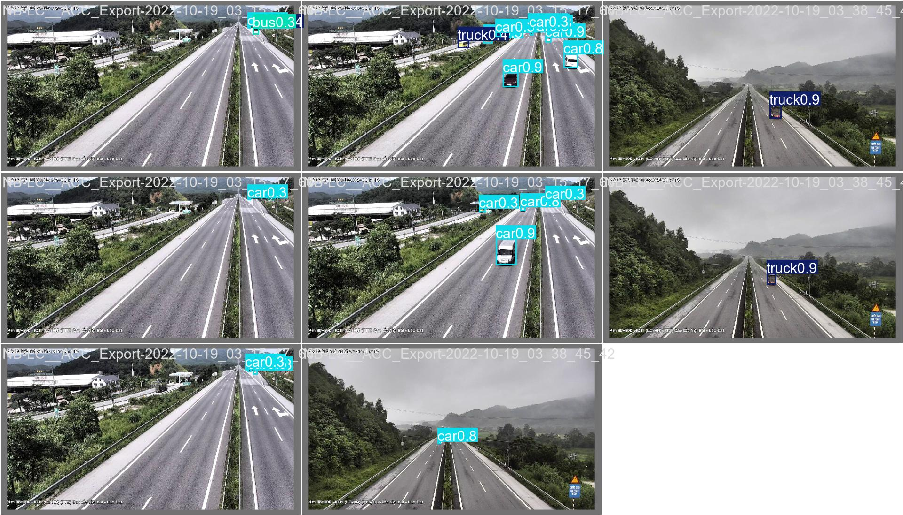

**Hình 4.9: Kết quả phát hiện đối tượng của YOLO11s_vn trên một batch ảnh validation thật**

Hình 4.10 minh hoạ chức năng vẽ bản đồ và danh sách đối tượng đang theo dõi
(UC4.3), nền bản đồ thực OpenStreetMap đúng khu vực Phố Huế – Trần Khát
Chân; Hình 4.11 minh hoạ chức năng quản lý sự cố (UC3) với bảng cảnh báo theo
thời gian thực, lọc theo mức độ/camera.

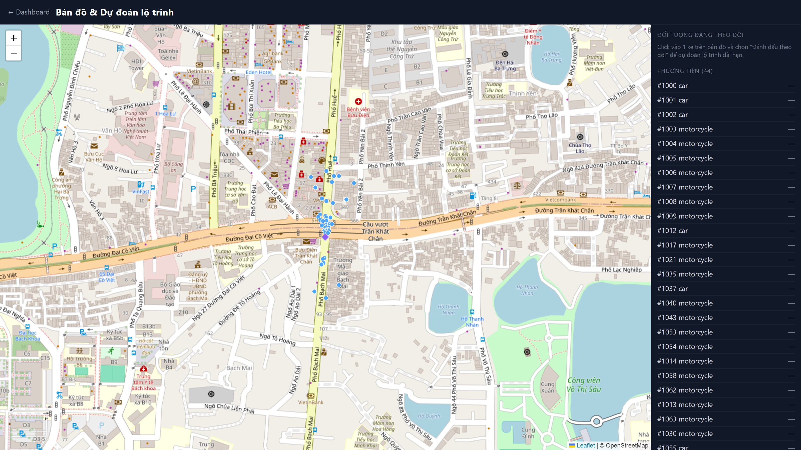

**Hình 4.10: Giao diện bản đồ — danh sách đối tượng đang theo dõi trên nền OpenStreetMap khu vực thật**

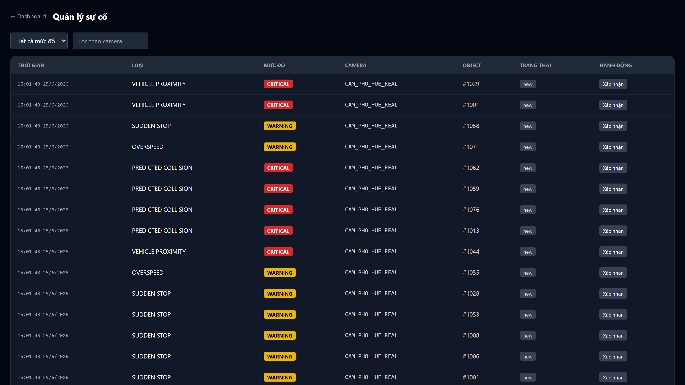

**Hình 4.11: Giao diện quản lý sự cố, chạy thật trên video Phố Huế – Trần Khát Chân**

*(Lưu ý: mật độ cảnh báo rất cao trong Hình 4.11 phản ánh đúng hạn chế về
ngưỡng phát hiện sự cố đã phân tích ở Chương 5, mục 5.5.4 — không phải lỗi
hiển thị của giao diện.)*

## 4.4 Kiểm thử

Công tác kiểm thử được thực hiện theo ba nhóm, tương ứng ba loại đầu ra của
hệ thống. Thứ nhất, dữ liệu auto-label dùng để huấn luyện YOLO11s_vn đã qua
kiểm tra định dạng và spot-check thủ công trước khi đưa vào huấn luyện
(`docs/qa_auto_label.md`), nhằm tránh nhãn lỗi làm sai lệch kết quả huấn
luyện. Thứ hai, các mô hình học máy (YOLO11s_vn, OSNet, Goal Classifier) được
đánh giá định lượng trên tập kiểm thử tách riêng khỏi tập huấn luyện, kết quả
tổng hợp ở Bảng 4.4. Thứ ba, chất lượng theo dõi (tracking) của ByteTrack
được đánh giá bằng chỉ số MOTA/IDF1 theo chuẩn CLEAR-MOT [3] qua thư viện
`py-motmetrics` — vì việc đo MOTA/IDF1 cần ground-truth track đồng bộ theo
từng khung hình (chỉ tự sinh được trong môi trường mô phỏng có kiểm soát,
chưa có trên video CCTV thật do cần gán nhãn tay), nội dung và kết quả chi
tiết của phần đánh giá này được trình bày riêng ở Chương 5 cùng với phân tích
nguyên nhân, để giữ Chương 4 tập trung vào kết quả đo trực tiếp trên dữ liệu
thật.

## 4.5 Triển khai

Hệ thống được triển khai và vận hành thử trực tiếp trên video CCTV thật tại
giao lộ Phố Huế – Trần Khát Chân (Hà Nội) — Hình 4.12. Quy trình triển khai
gồm ba bước: (1) xây dựng mạng lưới đường thực tế cho khu vực này từ
OpenStreetMap (Hình 4.8, mục 4.2.3); (2) hiệu chỉnh camera bằng phương pháp
khớp trực quan đã trình bày ở mục 3.6 — chiếu mạng lưới đường lên một khung
hình của video rồi tinh chỉnh vị trí/góc nghiêng/FOV camera bằng mắt cho tới
khi khớp với đường thật trong ảnh (Hình 4.13); (3) chạy pipeline đầy đủ
(YOLO11s_vn → ByteTrack → Goal Classifier real-world → Route Predictor trên
bản đồ Phố Huế) trên video, với chức năng đánh dấu sự cố được kích hoạt thủ
công qua API `POST /api/incidents/{id}/mark` trong lúc video đang chạy — vì
video CCTV thật không có cảm biến va chạm như môi trường mô phỏng.

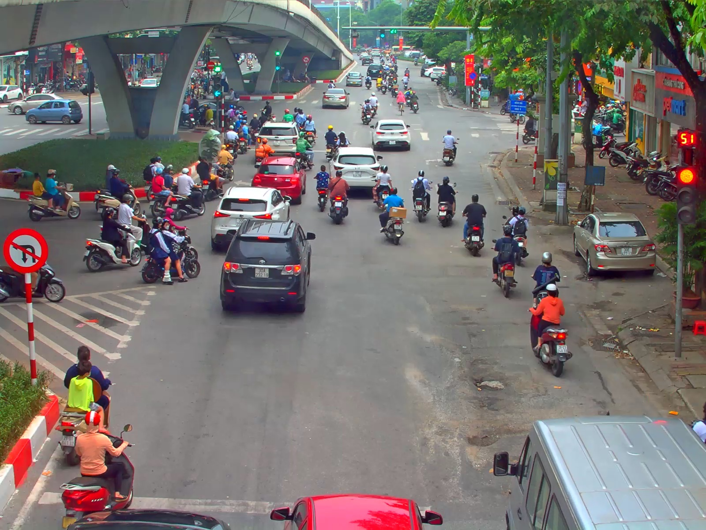

**Hình 4.12: Khung hình thực tế từ video CCTV tại giao lộ Phố Huế – Trần Khát Chân**

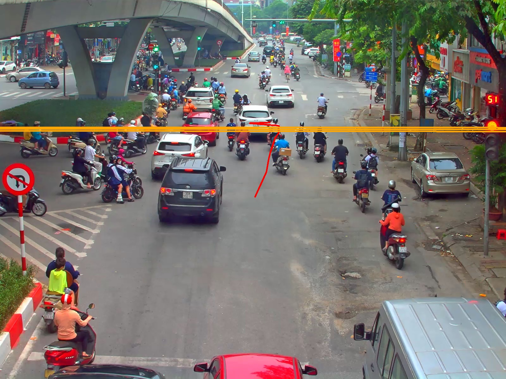

**Hình 4.13: Hiệu chỉnh camera — chiếu mạng lưới đường thực tế (từ OpenStreetMap) lên khung hình video để khớp vị trí/góc camera bằng mắt**

Hình 4.14 trình bày sơ đồ triển khai vật lý: toàn bộ AI Pipeline, Backend
Server và bản build tĩnh của Frontend chạy trên một máy duy nhất (cấu hình
demo: Windows, GPU RTX 4060 8GB), không yêu cầu hạ tầng máy chủ chuyên dụng —
đúng yêu cầu phi chức năng "hiệu năng thời gian thực... không yêu cầu phần
cứng máy chủ chuyên dụng" (mục 2.4). Tiến trình CARLA (nếu dùng nguồn
`CARLAVideoSource` cho mục đích kiểm thử nội bộ, xem mục 4.1.1) chạy như một
tiến trình riêng, giao tiếp với AI Pipeline qua một cầu nối TCP cục bộ do
giới hạn phiên bản Python của CARLA 0.9.14 — không nằm trong luồng triển khai
chính dùng video CCTV thật.

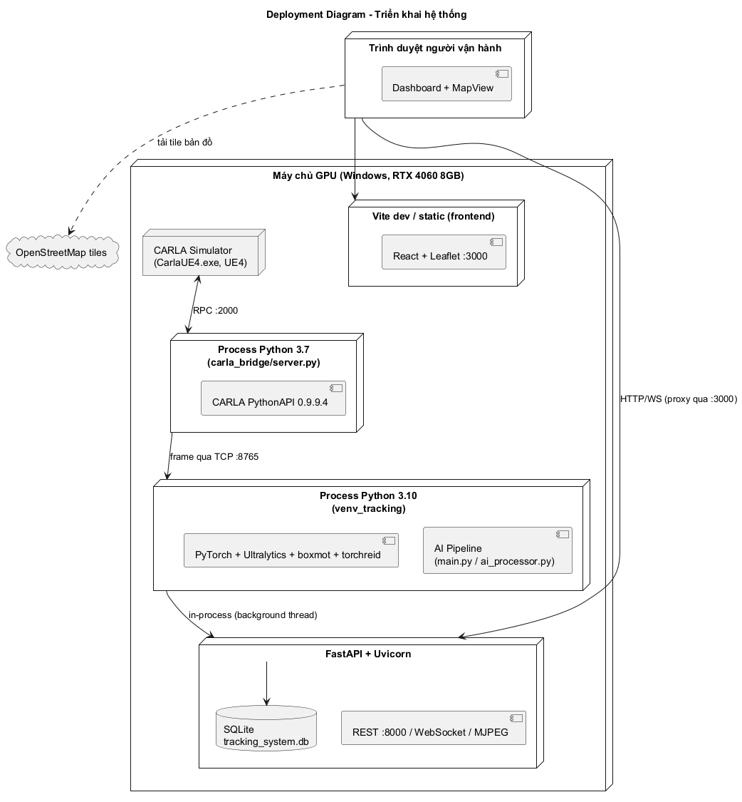

**Hình 4.14: Sơ đồ triển khai (deployment) hệ thống**

Việc vận hành thử này đã được kiểm tra đầu-cuối (script chạy không lỗi, vị trí
thế giới hợp lý, đánh dấu sự cố qua API thành công, hành trình dự đoán 4 hop
hiển thị đúng trên bản đồ thật), nhưng chưa được diễn tập trực tiếp trước hội
đồng — nội dung này được ghi nhận lại như một hạn chế cần khắc phục trước khi
báo cáo, trình bày ở Chương 6.

---

Chương này đã trình bày kiến trúc tổng thể, thiết kế chi tiết, công cụ triển
khai và kết quả đo được trên dữ liệu thật của hệ thống, cùng với việc vận
hành thử trực tiếp trên video CCTV thật tại giao lộ Phố Huế – Trần Khát Chân.
Các con số ở Bảng 4.4 cho thấy hệ thống đã hoạt động được trên dữ liệu thật ở
mức có thể chấp nhận cho một sản phẩm thử nghiệm, nhưng vẫn còn khoảng cách
tới một hệ thống sẵn sàng vận hành thực tế quy mô lớn. Chương 5 sẽ đi sâu vào
các vấn đề cụ thể đã phát hiện trong quá trình xây dựng từng thành phần, giải
pháp đã áp dụng và kết quả định lượng trước/sau khi áp dụng giải pháp đó.

---

## TÀI LIỆU THAM KHẢO (Chương 4)

[1] Michael Bayer, "SQLAlchemy — The Database Toolkit for Python." [Online].
Available: https://www.sqlalchemy.org/ (truy cập 06/2026).

[2] S. Colvin et al., "Pydantic — Data Validation Using Python Type Hints."
[Online]. Available: https://docs.pydantic.dev/ (truy cập 06/2026).

[3] K. Bernardin, R. Stiefelhagen, "Evaluating Multiple Object Tracking
Performance: The CLEAR MOT Metrics," *EURASIP Journal on Image and Video
Processing*, vol. 2008, article 246309, 2008.
