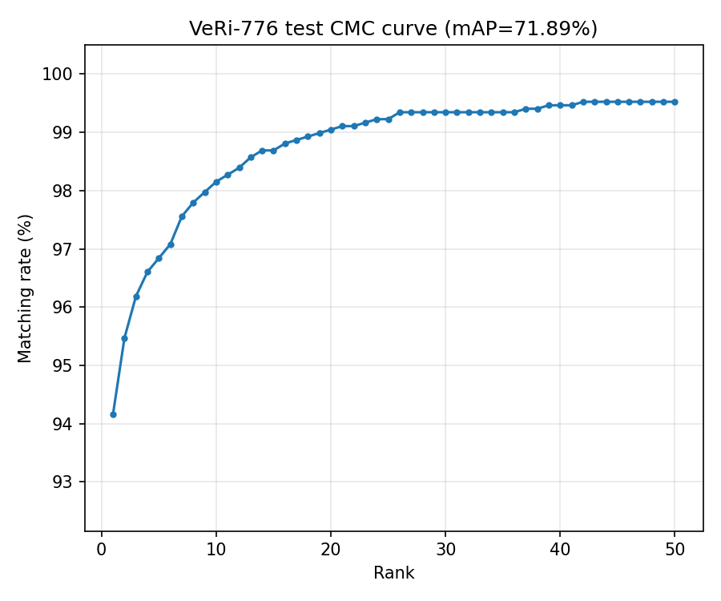

# CHƯƠNG 5. CÁC GIẢI PHÁP VÀ ĐÓNG GÓP NỔI BẬT

> Chương 4 đã trình bày kiến trúc, thiết kế và kết quả định lượng tổng quan
> của hệ thống trên dữ liệu thật. Trong quá trình xây dựng từng thành phần,
> đề tài đã phát hiện và xử lý một số vấn đề kỹ thuật cụ thể mà nếu chỉ trình
> bày kết quả cuối cùng ở Chương 4 sẽ không thấy được bản chất vấn đề cũng
> như mức độ cải thiện đã đạt được. Chương 5 đi sâu vào năm vấn đề như vậy,
> trình bày theo cấu trúc vấn đề → giải pháp → kết quả: dự đoán hành trình
> nhiều ngã tư của Route Predictor (5.1), lệch tham số horizon giữa huấn
> luyện và suy luận của Goal Classifier (5.2), phương pháp đánh giá đúng
> chuẩn cho OSNet fine-tune trên VeRi-776 (5.3), hiện tượng quên thảm khốc
> (catastrophic forgetting) khi fine-tune YOLO11 trên một domain hẹp (5.4), và
> một lỗi đồng hồ gây cảnh báo giả ở bộ phát hiện sự cố (5.5).

---

## 5.1 Route Predictor — sửa lỗi tìm đường gần nhất và thay giả định cứng bằng prior thực nghiệm

**Vấn đề.** Trong quá trình xây dựng UC4.2 (suy diễn hành trình nhiều ngã
tư), `route_predictor.py` dùng một chỉ mục không gian (spatial index) để tìm
đoạn đường gần nhất với vị trí hiện tại của đối tượng tại mỗi ngã tư. Đoạn
đường được `netconvert` (mục 3.6) tự sinh ra còn bao gồm các đoạn nối nội bộ
giữa các nhánh của một giao lộ (junction-connector stub road), nhiều đoạn
trong số đó dài dưới 1m và không có đoạn trước/sau hợp lệ. Khi đoạn gần nhất
tìm được lại là một stub này, hành trình suy diễn bị "chết" ngay từ ngã tư
đầu tiên. Đồng thời, với mọi ngã tư *sau* ngã tư đầu tiên trên hành trình
(hop ≥ 1), hệ thống dùng trực tiếp một giả định cứng `direction='straight',
confidence=1.0` — nghĩa là luôn hiển thị "đi thẳng, tin cậy 100%" cho mọi
bước suy diễn xa, không có cơ sở thực nghiệm nào chứng minh giả định này hợp
lý, và vi phạm trực tiếp yêu cầu phi chức năng "tính minh bạch của dự đoán"
(mục 2.4: "không hiển thị một dự đoán xa như thể chắc chắn tuyệt đối").

**Giải pháp.** Với lỗi tìm đường, giải pháp là lọc bỏ khỏi chỉ mục không gian
mọi đoạn đường ngắn hơn 1,5m trước khi tìm đoạn gần nhất — các đoạn này chỉ là
artifact nội bộ của bước chuyển đổi OSM → OpenDRIVE, không phải đoạn đường
thật mà phương tiện có thể "đứng" trên đó. Với giả định cứng, đề tài đo thực
nghiệm tần suất xảy ra của từng hướng đi tại các ngã tư sau ngã tư đầu tiên,
bằng cách khai thác một nguồn dữ liệu có sẵn quỹ đạo nhiều ngã tư liên tiếp
trên cùng một mạng lưới đường: dữ liệu mô phỏng dùng để huấn luyện bộ dự đoán
quỹ đạo GRU (`modules/trajectory_gru.py` — không phải sản phẩm chính, xem
đánh giá nội bộ ở Chương 6), gồm 36.997 lượt qua ngã tư, lọc ra 34.698 lượt
hợp lệ ở hop ≥ 1. Tần suất đo được cho từng hướng (straight = 0,370; left = 0,366;
right = 0,179; u_turn = 0,085) được lưu thành một prior thực nghiệm
(`data/route_predictor_priors.json`) và dùng thay cho giả định cứng tại mọi
hop ≥ 1; hop đầu tiên (ngay sau khi quan sát được đối tượng) vẫn dùng dự đoán
thật từ Goal Classifier (mục 5.2). Một lỗi liên quan cũng được phát hiện và
sửa trong cùng lần kiểm tra: hướng dự đoán thật được gán theo *chỉ số vòng
lặp* (`hop==0`) thay vì "ngã tư thật đầu tiên gặp được" — trên các bản đồ có
nhiều đoạn nối ngắn giữa camera và ngã tư thật gần nhất (như bản đồ Phố Huế ở
mục 4.5), điều này khiến dự đoán thật từ Goal Classifier bị bỏ qua hoàn toàn
nếu đoạn đường gần nhất ban đầu chưa phải là một ngã tư thật.

*Lưu ý về phạm vi số liệu: prior thực nghiệm này được đo trên dữ liệu mô
phỏng (môi trường có thể tự sinh quỹ đạo nhiều ngã tư liên tiếp với độ chính
xác tuyệt đối, điều dữ liệu CCTV thật hiện chưa có), nên chỉ dùng làm chẩn
đoán/tham khảo nội bộ cho cấu trúc xử lý của Route Predictor, không phải một
con số đo trên hệ thống thật.*

**Kết quả.** Giả định "luôn đi thẳng" cho hop ≥ 1 chỉ đúng 37,04% trường hợp
trong dữ liệu đo được — gần như ngang bằng với "rẽ trái" (36,6%) — cho thấy hệ
thống thực sự không có cơ sở để tự tin hơn ~37% cho các bước suy diễn xa, và
việc hiển thị "100% tin cậy" trước đó là sai lệch nghiêm trọng so với độ
chắc chắn thật. Sau khi thay bằng prior thực nghiệm, mức tin cậy hiển thị cho
hop ≥ 1 phản ánh đúng ~37% thay vì 100% — đáp ứng đúng yêu cầu minh bạch dự
đoán. Một mô hình Markov bậc 1 (dùng thêm hướng của hop ngay trước) cũng được
thử nghiệm nhưng chỉ đạt 39,01% — cải thiện không đáng kể so với prior đơn
giản, nên không được áp dụng. Cả hai bản đồ (Town10HD_Opt dùng cho kiểm thử
nội bộ và Phố Huế–Trần Khát Chân dùng cho demo thật, mục 4.5) đã được hồi quy
kiểm tra (regression test) sau khi áp dụng sửa lỗi, không phát sinh lỗi mới.

## 5.2 Goal Classifier real-world — phát hiện lệch tham số horizon và so sánh kiến trúc mô hình

**Vấn đề.** Sau khi triển khai Goal Classifier huấn luyện trên dữ liệu CCTV
thật (mục 3.5), quá trình rà soát lại mã nguồn phát hiện một điểm lệch giữa
huấn luyện và suy luận: `modules/goal_classifier.py` đã hardcode tham số
`_HORIZON = 1.5` tại thời điểm suy luận (với chú thích "kết quả tốt nhất theo
horizon từ lúc huấn luyện"), nhưng trọng số đang triển khai thực tế
(`weights/goal_classifier_real.pkl`) lại được huấn luyện với giá trị mặc định
của script huấn luyện là `--horizon 1.0` — nghĩa là mô hình suy luận trên một
cửa sổ đặc trưng khác với cửa sổ nó thực sự được huấn luyện, một lỗi lệch
train/inference có từ trước, không được phát hiện vì hệ thống vẫn chạy không
lỗi (không có exception nào để báo hiệu sự lệch này).

**Giải pháp.** Huấn luyện lại mô hình với đúng `--horizon 1.5` để khớp với
giá trị dùng ở suy luận, triển khai trọng số mới (sao lưu trọng số cũ tại
`weights/_backup_horizon1.0/`). Đồng thời, để kiểm tra xem kiến trúc
Gradient Boosting có còn là lựa chọn tốt nhất hay không sau khi đã có dữ liệu
thật ổn định, đề tài so sánh trực tiếp ba kiến trúc trên cùng dữ liệu và cùng
cách chia tập huấn luyện/kiểm thử: Gradient Boosting (đang dùng), Random
Forest, và một mạng nơ-ron nhiều lớp (MLP).

**Kết quả.** Việc khớp lại horizon cải thiện rõ kết quả: accuracy tổng thể
59,73% → 60,12%, balanced accuracy 51,96% → 54,18%, recall lớp "rẽ trái"
53,7% → 60,5%, recall lớp "rẽ phải" 55,2% → 58,4% — xác nhận lệch
train/inference trước đó thực sự làm giảm chất lượng dự đoán, dù không gây
lỗi runtime nào. Trong so sánh ba kiến trúc, không kiến trúc nào vượt được độ
chính xác tổng thể của Gradient Boosting trên dữ liệu hiện có; Random Forest
cho hiệu chỉnh xác suất tốt hơn rõ rệt (ECE ≈ 0,021 so với ≈ 0,12 của Gradient
Boosting) và recall lớp "quay đầu" cao hơn (44,8% so với khoảng 36% của
Gradient Boosting), nhưng đổi lại accuracy tổng thể thấp hơn — được ghi nhận
lại như một lựa chọn thay thế khả thi nếu yêu cầu vận hành sau này ưu tiên độ
tin cậy hiển thị hơn độ chính xác thô. Mô hình production hiện tại
(`weights/goal_classifier_real.pkl`, Gradient Boosting + `CalibratedClassifierCV`,
horizon = 1,5s) đạt accuracy = 60,12%, balanced accuracy = 54,18% trên tập
kiểm thử 1.334 track tách riêng khỏi 5.332 track huấn luyện (xem Bảng 4.4),
với recall theo lớp: đi thẳng 61,67%, rẽ trái 60,54%, rẽ phải 58,4%, quay đầu
36,11% (lớp yếu nhất, chỉ 36 mẫu kiểm thử — số liệu chưa đủ tin cậy thống kê,
xem hạn chế ở Chương 6).

## 5.3 OSNet fine-tune trên VeRi-776 — tách bạch đo lường huấn luyện và đánh giá ReID chuẩn

**Vấn đề.** Khi tiếp tục huấn luyện OSNet trên VeRi-776 (resume từ epoch 12,
huấn luyện tới epoch 60), độ chính xác (`val_acc`) ghi nhận được trong vài
epoch đầu chỉ khoảng 0,1% — một dấu hiệu bất thường rõ ràng (gần như ngẫu
nhiên trên 575 lớp phương tiện). Rà soát `scripts/train/train_veri.py` phát
hiện nguyên nhân là một lỗi đo lường, không phải lỗi huấn luyện: ở chế độ
đánh giá (`eval()`), OSNet chỉ trả về trực tiếp vector đặc trưng (feature
embedding, dùng cho việc so khớp ReID), không trả về cặp `(embedding, logits)`
như ở chế độ huấn luyện — nhưng code tính accuracy lại lấy thẳng embedding đó
để tính `argmax`, tương đương lấy ngẫu nhiên 512 "lớp" ảo thay vì 575 lớp
phương tiện thật.

**Giải pháp.** Sửa bằng cách đưa embedding đi qua đúng lớp `classifier` của
mô hình trước khi tính `argmax`, khớp với cách chế độ huấn luyện tính
accuracy. Sau khi sửa, huấn luyện tiếp từ epoch 12 đến epoch 60
(batch = 16–32, learning rate giảm dần theo cosine annealing 3×10⁻⁴ → 10⁻⁶).
Tuy nhiên, độ chính xác phân loại đóng (closed-set classification accuracy)
đo được trong lúc huấn luyện — dù đã sửa đúng — vẫn không phải thước đo ReID
chuẩn, vì nó chỉ đánh giá trên đúng 575 ID phương tiện đã thấy lúc huấn
luyện. Vì vậy đề tài triển khai một giai đoạn đánh giá riêng, độc lập với quá
trình huấn luyện: `scripts/eval/eval_veri_reid.py`, theo đúng giao thức chuẩn
kiểu Market-1501 cho ReID mở (open-set) — so khớp truy vấn (query) với một
tập gallery riêng, loại bỏ các ảnh cùng định danh *và* cùng camera với ảnh
truy vấn để tránh đánh giá lạc quan giả, tính mAP và đường cong CMC (Hình
5.1) trên 1.678 ảnh truy vấn / 11.579 ảnh gallery của tập kiểm thử VeRi-776
chuẩn.

**Hình 5.1: Đường cong CMC (Cumulative Matching Characteristic) của OSNet fine-tune trên tập kiểm thử VeRi-776 chuẩn**

**Kết quả.** Độ chính xác phân loại đóng đạt 99,97% ở epoch cuối (epoch 49 đạt
100,00%) — xác nhận lỗi đo lường đã được sửa đúng và quá trình huấn luyện hội
tụ tốt trên tập huấn luyện. Quan trọng hơn, đánh giá ReID mở chuẩn cho kết quả
**mAP = 71,89%, Rank-1 = 94,16%, Rank-5 = 96,84%** (Bảng 4.4, Hình 5.1) — nằm
trong vùng kết quả tốt so với các công bố OSNet trên VeRi-776 (mAP thường
trong khoảng 60–75%, Rank-1 trong khoảng 90–96% tuỳ kỹ thuật huấn luyện), xác
nhận mô hình thực sự học được khả năng nhận diện lại mở (chưa từng thấy đúng
cặp ảnh đó lúc huấn luyện), không phải kết quả ảo do quá khớp (overfit) trên
tập đóng. Trọng số này (`osnet_veri776_v2.pth`) đã được triển khai làm nhánh
ReID phương tiện mặc định trong `DualReIDExtractor` (đã xác nhận hoạt động
đúng qua kiểm thử ở mục 4.4), thay cho trọng số cũ chưa từng được đánh giá
định lượng.

## 5.4 YOLO11 — hiện tượng quên thảm khốc khi fine-tune trên một domain hẹp

**Vấn đề.** Sau khi triển khai YOLO11s_vn (huấn luyện trên dữ liệu CCTV thật,
mục 4.3.2), đề tài thử fine-tune tiếp một vòng thứ hai trên một tập dữ liệu
hẹp hơn (`carla_cam_det_v2`, ảnh dựng từ môi trường mô phỏng, đúng góc nhìn
của bộ camera kiểm thử nội bộ) để kiểm tra khả năng đo MOTA/IDF1 đầy đủ trong
môi trường có kiểm soát. Vòng fine-tune này đạt mAP50 = 80,5% tốt trên chính
domain hẹp đó, nhưng khi đánh giá lại checkpoint mới trên domain dữ liệu thật
hỗn hợp ban đầu (`visdrone_carla_vn`), mAP50 sụt từ 50,7% xuống chỉ còn 0,6%
— một trường hợp điển hình của hiện tượng *quên thảm khốc* (catastrophic
forgetting): mô hình học rất tốt domain mới nhưng đánh đổi gần như toàn bộ
khả năng đã học trên domain cũ.

**Giải pháp.** Vì mục tiêu triển khai thật của hệ thống là video CCTV
(domain rộng, đa dạng), không phải domain mô phỏng hẹp, đề tài quyết định
**không** dùng checkpoint fine-tune vòng hai làm checkpoint sản xuất. Thay
vào đó, hai checkpoint được giữ tách biệt cho hai mục đích khác nhau:
`yolo11s_vn.pt` (huấn luyện trên dữ liệu CCTV thật, dùng cho production — số
liệu ở Bảng 4.4) và `yolo11s_carla_v2.pt` (fine-tune domain hẹp, chỉ dùng cho
mục đích chẩn đoán/kiểm thử nội bộ trong môi trường mô phỏng có kiểm soát,
không dùng cho hệ thống thật). Để kiểm tra xem chiến lược giữ hai checkpoint
riêng có thực sự cải thiện được khả năng đo lường nội bộ hay không (so với
domain gap rất lớn từng đo được trước đó), đề tài đo lại MOTA/IDF1 của
ByteTrack trong môi trường mô phỏng có kiểm soát, dùng `yolo11s_carla_v2.pt`
làm detector, theo đúng quy trình tự động đã dùng cho lần đo gốc (mục
4.4/Bảng dưới).

*Lưu ý về phạm vi số liệu: toàn bộ phần này — bao gồm số liệu MOTA/IDF1 dưới
đây — là chẩn đoán nội bộ trong môi trường mô phỏng có kiểm soát, dùng để trả
lời câu hỏi kỹ thuật "fine-tune vòng hai có giảm domain gap đã từng gây
MOTA âm không", không phải kết quả đo trên hệ thống CCTV thật.*

**Kết quả.** Lần đo gốc (detector `yolo11s_vn.pt`, conf = 0,35, 100 khung
hình, 3 camera trong môi trường mô phỏng) cho MOTA tổng thể = −23,6%, IDF1 =
0,26%, do recall phát hiện rất thấp (3,96%) — nguyên nhân chính là khoảng
cách domain giữa dữ liệu huấn luyện (ảnh thật) và ảnh dựng từ môi trường mô
phỏng. Đo lại với `yolo11s_carla_v2.pt` (cùng conf = 0,35, mở rộng ra 6
camera, 1.000 khung hình) cho **MOTA tổng thể = −51,6%** — *tệ hơn* lần đo
gốc, không hề cải thiện. Recall vẫn ở mức 0% trên toàn bộ 6 camera (tệ hơn cả
3,96% của lần đo gốc). Bảng 5.1 đối chiếu hai lần đo.

**Bảng 5.1: So sánh MOTA/IDF1 trước/sau fine-tune vòng hai (chẩn đoán nội bộ, môi trường mô phỏng)**

| | `yolo11s_vn.pt` (gốc) | `yolo11s_carla_v2.pt` (fine-tune vòng 2) |
|---|---|---|
| Số camera / khung hình | 3 / 100 | 6 / 1.000 |
| MOTA tổng thể | −23,6% | **−51,6%** |
| IDF1 tổng thể | 0,26% | 0,0% |
| Recall | 3,96% | 0% |
| FP / FN (tổng) | 433 / 1.822 | 10.445 / 20.247 |

Đáng chú ý hơn cả con số tổng, hành vi của detector rất không đồng đều giữa
các camera — một dấu hiệu rõ của quá khớp domain hẹp, không chỉ đơn thuần là
"vẫn còn domain gap": ở 2/6 camera (CAM_001, CAM_005), detector không đưa ra
**bất kỳ phát hiện nào** trong suốt 1.000 khung hình, dù vẫn có đối tượng thật
xuất hiện trong vùng nhìn của camera đó (3 và 7 track ground-truth tương
ứng); ở 4 camera còn lại, detector lại tạo ra số lượng phát hiện sai (false
positive) rất lớn không khớp với bất kỳ đối tượng thật nào — ví dụ CAM_002 có
4.000 phát hiện "car" trên 1.000 khung hình, nhưng đối tượng ground-truth duy
nhất xuất hiện ở camera này lại nằm ở một vùng ảnh hoàn toàn khác (không
trùng IoU với bất kỳ phát hiện nào). Đã loại trừ khả năng đây là một lỗi đo
lường (ví dụ lỗi ánh xạ nhãn lớp COCO/VN từng gặp ở một vòng fine-tune trước
— xem `docs/bao_cao_tien_do.md`): nhãn lớp dự đoán đa dạng (car/motorcycle/
truck), và bộ đánh giá chỉ so khớp theo IoU, không phụ thuộc nhãn lớp.

Kết quả này cho thấy fine-tune trực tiếp trên domain hẹp (`carla_cam_det_v2`,
đúng góc nhìn của một bộ camera kiểm thử cụ thể) không chỉ không giảm được
domain gap đã quan sát trước đó, mà còn làm mô hình **quá khớp vào đặc điểm
hẹp** của chính bộ dữ liệu fine-tune (góc camera, khung cảnh cụ thể) đến mức
mất ổn định ngay trong nội bộ môi trường mô phỏng — tốt ở một vài góc camera
giống dữ liệu huấn luyện, hỏng hoàn toàn ở các góc còn lại. Đây là một minh
chứng rõ hơn cho hiện tượng quên thảm khốc so với giả thuyết ban đầu (chỉ kỳ
vọng mất khả năng trên domain *khác*, không kỳ vọng mất ổn định ngay trong
*cùng* môi trường mô phỏng). Kết quả này càng củng cố quyết định không dùng
checkpoint này cho sản xuất, và cho thấy việc tìm một checkpoint hợp nhất
(Chương 6) cần được kiểm tra chéo trên nhiều góc camera/khung cảnh khác nhau,
không chỉ trên đúng domain hẹp đã dùng để fine-tune. Bài học chung rút ra:
fine-tune trực tiếp trên một domain hẹp để cải thiện đo lường nội bộ có chi
phí đánh đổi đáng kể với khả năng tổng quát hoá, kể cả trong cùng môi trường
mô phỏng — chiến lược giữ tách biệt checkpoint theo mục đích sử dụng (kiểm
thử nội bộ vs. sản xuất thật) là cách xử lý an toàn hơn so với việc tìm một
checkpoint "tốt cho cả hai", và việc tiếp tục tìm một checkpoint hợp nhất qua
fine-tune đa domain có kiểm soát (trộn dữ liệu, đóng băng backbone nhiều hơn,
giảm learning rate/epoch) được ghi nhận là hướng phát triển ở Chương 6.

## 5.5 Bảy lỗi và bốn kiểm chứng bằng dữ liệu thật — phát hiện qua kiểm thử trực tiếp toàn bộ hệ thống

Mục này trình bày liền mạch bảy lỗi cụ thể phát hiện được khi xác minh
`IncidentDetector` trên video CCTV thật (5.5.1–5.5.4), khi chạy thử toàn
bộ hệ thống — AI Pipeline + Backend Server + Frontend cùng lúc, đúng kịch
bản triển khai thật ở mục 4.5 (5.5.5–5.5.6) — và khi xây quy trình đo
MOTA/IDF1 thật trên video CCTV (5.5.8), cùng bốn kết quả kiểm chứng trực
tiếp bằng dữ liệu/công cụ thật (không phải sửa lỗi code, mà là phát hiện
thực tế khác với giả định/tài liệu trước đó): vấn đề ngưỡng cảnh báo còn tồn
đọng sau sáu lỗi đầu (5.5.7); quy trình lấy ground-truth tracking (5.5.8);
ROI vượt đèn đỏ đặt sai vị trí, tìm ra bằng công cụ dò vạch sơn tự xây
(5.5.9); và GRU huấn luyện trên CARLA hoá ra đang ảnh hưởng dự đoán hiển thị
live, không phải "chưa tích hợp" như tưởng (5.5.10). Bốn lỗi đầu được tìm ra
nối tiếp nhau trong cùng một lượt kiểm tra, và — quan trọng hơn — việc sửa
lỗi đầu tiên trong số đó lại làm lộ ra một vấn đề sâu hơn mà ba lỗi sau mới
giải quyết được một phần.

### 5.5.1 Lỗi đồng hồ thời gian gây nhiễu vận tốc

**Vấn đề.** Các quy tắc `SUDDEN_STOP`/`SUDDEN_ACCEL` (mục 3.4) tính vận tốc
đối tượng bằng *quãng đường đi được giữa hai mẫu* chia cho *khoảng thời gian
giữa hai mẫu* (Δt). Trước khi sửa, Δt được lấy từ đồng hồ hệ thống
(`time.time()`) tại thời điểm xử lý xong một khung hình. Vấn đề là việc đọc
một file video qua OpenCV không bị ràng buộc tốc độ thời gian thực — nếu CPU
xử lý một khung hình chậm hơn bình thường (ví dụ do tải tức thời từ mô hình
phát hiện hoặc ReID), Δt theo đồng hồ hệ thống sẽ lớn hơn Δt thật của video,
khiến vận tốc tính ra bị nhiễu theo *tốc độ xử lý của máy* thay vì theo *nội
dung video*.

**Giải pháp.** Sửa `FileVideoSource` để tính mốc thời gian của mỗi khung hình
theo **đồng hồ nội dung video** (`t0 + frame_index / fps`) thay vì đồng hồ hệ
thống tại thời điểm xử lý. Mốc thời gian này được truyền nhất quán qua toàn
bộ pipeline xuôi dòng: `ByteTrackWrapper.update()` nhận thêm tham số
`timestamp` tường minh (mặc định dùng đồng hồ hệ thống nếu không truyền, để
tương thích các nguồn không cần đồng hồ nội dung như RTSP), và cả `main.py`
cũng như `server/services/ai_processor.py` được sửa để lấy mốc thời gian trực
tiếp từ khung hình nguồn thay vì gọi `time.time()` một lần dùng chung cho cả
batch.

### 5.5.2 Lỗi không tận dụng cơ chế "tin tưởng" track cục bộ — Global ID bị phân mảnh

**Vấn đề.** Khi xác minh lại lỗi 5.5.1 trên toàn bộ pipeline (qua `main.py`,
không chỉ qua script demo), phát hiện một hiện tượng nghiêm trọng hơn: chỉ
trong chưa đầy 100 khung hình của **một** camera, hệ thống đã cấp tới hơn 280
Global ID mới — quá nhiều so với số phương tiện thực tế có thể xuất hiện
trong vài chục giây. Truy ra nguyên nhân trong `modules/global_tracking.py`:
`GlobalTracker.process_camera_tracks()` có sẵn tham số `reid_track_ids` để
"tin tưởng" Global ID đã gán cho một track cục bộ đang còn liên tục, chỉ chạy
lại ReID khi cần xác nhận chéo camera hoặc theo chu kỳ — nhưng `main.py` gọi
hàm này **không truyền** tham số đó, khiến `run_reid` luôn `True`: hệ thống
chạy lại trích đặc trưng + so khớp gallery (ngưỡng cosine 0,5) cho **mọi
track, mọi khung hình**, kể cả khi local track_id của ByteTrack không đổi.
Chỉ cần một khung hình cho crop xấu (mờ, nhỏ, góc lạ — rất dễ xảy ra với xe
máy xa camera) khiến điểm tương đồng tụt dưới ngưỡng, hệ thống lập tức cấp
Global ID mới cho đúng đối tượng đang được theo dõi ổn định.

**Giải pháp.** Sửa `main.py` để tính tập `reid_track_ids` theo đúng cơ chế đã
có sẵn và đang dùng ở `server/services/ai_processor.py` (`REID_INTERVAL=3`):
chỉ chạy ReID cho track cục bộ mới xuất hiện lần đầu ở camera đó, hoặc theo
chu kỳ mỗi 3 khung hình cho track đã có — track cục bộ liên tục được tin
tưởng giữ nguyên Global ID đã gán ở giữa các chu kỳ đó.

### 5.5.3 Hai lỗi `np.gradient` chia cho khoảng cách thời gian gần-không gây crash

**Vấn đề.** Khi kiểm tra lại sau 5.5.2 trên một đoạn dài hơn, pipeline crash
với `ValueError: Input X contains infinity` rồi `... contains NaN` ở
`GoalClassifier.update_and_predict`. Đọc `modules/goal_classifier.py` phát
hiện: dòng tính vận tốc (`vx_arr = np.gradient(cx_arr, t_arr)`) và dòng tính
gia tốc bên dưới (`ax = np.gradient(vx_arr, t_arr)`) đều dùng trực tiếp mốc
thời gian thô `t_arr` — trong khi đó, ngay phía trên, code đã tự tính một
biến đệm chống chia-0 (`dt_arr = np.where(dt_arr < 1e-6, 1e-6, dt_arr)`) nhưng
**không hề dùng** biến đó cho `np.gradient`. Nếu hai mẫu vị trí liên tiếp
trong lịch sử của một track có mốc thời gian trùng hoặc gần trùng nhau,
`np.gradient` chia nội bộ cho khoảng cách gần-không đó, ra `inf`/`NaN`, lan
vào toàn bộ vector đặc trưng và làm `StandardScaler`/`GradientBoostingClassifier`
của Goal Classifier crash ngay khi nhận đặc trưng.

**Giải pháp.** Dựng lại một mốc thời gian "an toàn" (`t_safe`) từ đúng
`dt_arr` đã được chặn dưới sẵn có, rồi dùng `t_safe` thay cho `t_arr` ở cả
hai lời gọi `np.gradient` (vận tốc và gia tốc) — tái sử dụng đúng cơ chế bảo
vệ tác giả gốc đã viết ra nhưng quên gắn vào chỗ cần dùng.

### 5.5.4 Phát hiện bất ngờ: sửa đúng 5.5.2 lại làm lộ một vấn đề sâu hơn

Sau khi sửa cả bốn lỗi trên, kiểm tra lại bằng một thí nghiệm đối chứng công
bằng — chạy đúng 150 khung hình đầu của cùng video CCTV thật (Phố Huế – Trần
Khát Chân), một lần với mã gốc (trước sửa, qua `git stash`) và một lần với
mã đã sửa, cùng cấu hình, cùng dữ liệu — cho kết quả gây bất ngờ (Bảng 5.2).

**Bảng 5.2: Số cảnh báo phát sinh trên cùng 150 khung hình, trước/sau khi sửa 4 lỗi ở mục 5.5.1–5.5.3**

| Loại cảnh báo | Trước khi sửa | Sau khi sửa |
|---|---|---|
| SUDDEN_STOP | 0 | 884 |
| SUDDEN_ACCEL | 0 | 45 |
| VEHICLE_PROXIMITY | 0 | 289 |
| PREDICTED_COLLISION | 0 | 81 |
| OVERSPEED | 0 | 46 |
| STOPPED_VEHICLE | 15 | 0 |
| Tổng số Global ID mới | 266 | 359 |

*(Số cảnh báo đã quy đổi đúng về số sự cố thật — mỗi sự cố được ghi log 2
lần ở 2 logger khác nhau trong code, `incident_detector.py` và `main.py`,
nên đếm trực tiếp theo dòng log sẽ gấp đôi con số thật.)*

Thoạt nhìn có vẻ việc sửa lỗi làm hệ thống "tệ đi" — nhưng đây là một hệ quả
logic, không phải một lỗi mới: trước khi sửa 5.5.2, Global ID bị phân mảnh
liên tục (mỗi vài khung hình lại đổi ID mới cho cùng một xe), nên **không
track nào tồn tại đủ lâu dưới một Global ID duy nhất** để các quy tắc dựa
trên lịch sử vận tốc (`SUDDEN_STOP`, `SUDDEN_ACCEL`, và gián tiếp cả
`VEHICLE_PROXIMITY`/`PREDICTED_COLLISION`/`OVERSPEED` qua `_current_speed()`)
tích lũy đủ mẫu để kích hoạt — lỗi phân mảnh ID ở 5.5.2 **vô tình che giấu**
một vấn đề khác đã tồn tại từ trước: vận tốc ước lượng theo pixel cho phương
tiện nhỏ/xa camera (đặc biệt xe máy) dao động đủ mạnh giữa các khung hình
liên tiếp (do nhiễu của khung bao phát hiện) để liên tục chạm các ngưỡng
cảnh báo, miễn là track đó tồn tại đủ lâu — và sau khi sửa đúng lỗi phân
mảnh ID, phần lớn track giờ tồn tại đủ lâu để bộc lộ đầy đủ vấn đề này.

**Đánh giá trung thực.** Việc sửa lỗi đồng hồ (5.5.1), lỗi phân mảnh ID
(5.5.2) và lỗi crash `inf`/`NaN` (5.5.3) đều là sửa lỗi đúng và cần thiết —
không có lý do kỹ thuật nào để giữ lại bất kỳ lỗi nào trong ba lỗi đó. Nhưng
kết quả ở Bảng 5.2 cho thấy hệ thống cảnh báo sự cố, sau khi đã sửa đúng tầng
theo dõi/định danh, vẫn còn một vấn đề thiết kế ngưỡng riêng (ngưỡng
`min_moving_speed=8 px/s` rất thấp, so sánh dựa trên 1–2 mẫu vận tốc tức thời
thay vì một cửa sổ đủ dài, không yêu cầu trạng thái "đang dừng"/"đang tiến
gần" phải duy trì liên tục qua nhiều khung hình) chưa phù hợp với độ nhiễu
thật của vận tốc ước lượng từ pixel ở khoảng cách camera CCTV thật. Mục
5.5.7 dưới đây trình bày kết quả kiểm chứng trực tiếp vấn đề này bằng dữ
liệu thật có gán nhãn tay.

### 5.5.7 Kiểm chứng bằng dữ liệu thật có nhãn — 100% false positive trên 5 loại cảnh báo

**Quy trình.** Theo `docs/plan_tinh_chinh_nguong_incident.md`: (1) thêm
`modules/incident_snapshot.py`, lưu 1 ảnh đã chú giải (mọi khung bao + ID,
tái dùng `Visualizer.draw_tracks()`) và 1 file JSON (loại, mức độ, các giá
trị đã kích hoạt luật) cho **mọi** cảnh báo phát sinh, không chỉ mức
CRITICAL; (2) chạy hệ thống trên video Phố Huế thật, sinh ra vài trăm cảnh
báo thuộc cả 5 loại đang nghi vấn (`SUDDEN_STOP`, `SUDDEN_ACCEL`,
`VEHICLE_PROXIMITY`, `PREDICTED_COLLISION`, `OVERSPEED`); (3) xem trực tiếp
từng ảnh, đối chiếu hành vi thật của đối tượng được nêu trong cảnh báo.

**Kết quả.** Trên toàn bộ mẫu đã xem qua cả 5 loại, **không có một cảnh báo
nào phản ánh đúng tình huống nguy hiểm thật** — 100% false positive. Một ví
dụ điển hình minh hoạ rõ cơ chế gây lỗi: một cảnh báo `SUDDEN_ACCEL` với
`speed_prev=1{,}7 px/s` (gần như đứng yên, mức nhiễu pixel bình thường) và
`speed_now=26{,}9 px/s` (chỉ là tốc độ đi chậm bình thường trong dòng xe
đông) — tỉ lệ tăng ~15,8 lần vượt xa ngưỡng 2,5 lần của luật, nhưng tốc độ
tuyệt đối sau đó vẫn rất thấp, không hề là "tăng tốc bỏ trốn" như nội dung
cảnh báo diễn giải. Đây cho thấy bản chất vấn đề rộng hơn giả thuyết ban đầu
ở 5.5.4 (chỉ nghi ngờ nhiễu vận tốc tức thời của riêng `SUDDEN_STOP`/
`SUDDEN_ACCEL`): cả `VEHICLE_PROXIMITY`/`PREDICTED_COLLISION` (đã dùng vận
tốc làm mượt EWMA 5 mẫu, không phải giá trị tức thời) và `OVERSPEED` (ngưỡng
tuyệt đối cố định theo loại xe) cũng sai 100% — nhiều khả năng các ngưỡng
tuyệt đối (`min_moving_speed`, `proximity_px`, giới hạn tốc độ theo lớp,
đơn vị pixel/giây) chưa từng được hiệu chỉnh cho đúng khoảng cách/độ phân
giải (1600×1200) của camera Phố Huế cụ thể này, chứ không chỉ là vấn đề làm
mượt tín hiệu.

Vì không có một mẫu true positive nào trong dữ liệu đã xem, phương pháp
phân tích ngưỡng bằng precision/recall (Bước 3 của plan) **không áp dụng
được** — không tồn tại điểm phân tách giữa hai nhóm vì chỉ có một nhóm.
Giải pháp tạm thời được áp dụng ngay: tắt cả 5 loại cảnh báo này cho camera
Phố Huế qua cấu hình (`incident_detection.disabled_types` trong
`camera_config_pho_hue.yaml`) — trung thực hơn là giữ lại một tính năng đo
được không tạo giá trị thật, đồng thời loại bỏ luôn rủi ro đầy đĩa do
evidence capture (mục 5.5.6) vì các loại này đã sinh ra phần lớn số cảnh
báo CRITICAL trước đó. Quá trình áp dụng phát hiện thêm một lỗi wiring
trong `main.py`: hàm khởi tạo gọi `IncidentDetector()` không truyền tham số
`config` nào cả ở cả ba nhánh nguồn video (carla/bridge/file), nên
`disabled_types` khai báo trong file cấu hình **chưa từng có tác dụng** dù
đã khai báo đúng — đã sửa để truyền đúng `config.get('incident_detection',
{})` theo từng nhánh, xác nhận lại bằng cách chạy thử: cả 5 loại không còn
xuất hiện trong log, các loại khác (`PEDESTRIAN_DANGER`...) không bị ảnh
hưởng vẫn hoạt động bình thường.

**Hạn chế của kết luận này.** "100% false positive" là kết quả trên một
mẫu quan sát qua mắt người tại một camera, một thời điểm cụ thể — không
phải một con số đo lường thống kê có khoảng tin cậy. Việc tắt 5 loại cảnh
báo này chỉ nên coi là giải pháp tạm thời cho camera Phố Huế với cấu hình
ngưỡng hiện tại, không phải kết luận rằng các luật này vô dụng về bản chất;
hướng đi đúng (ghi nhận lại ở Chương 6) là hiệu chỉnh lại các ngưỡng tuyệt
đối theo đúng hình học/khoảng cách của từng camera, sau đó đo lại trên dữ
liệu có cả true và false positive.

### 5.5.5 Lỗi `uptime_seconds` trả về sai do hai bản sao module khác nhau

**Vấn đề.** Khi chạy thử toàn bộ hệ thống (Backend Server qua `python app.py
--with-ai ...` + Frontend), endpoint gốc `/` trả `uptime` hợp lý (vài chục
giây, đúng thời gian server vừa khởi động), nhưng `/api/stats` lại trả
`uptime_seconds` là một số khổng lồ (~1,78 tỷ giây — xấp xỉ đúng giá trị
epoch Unix hiện tại). Cả hai endpoint cùng gọi một hàm `get_uptime()` trong
`app.py`. Nguyên nhân: chạy `python app.py` khiến Python nạp file này dưới
tên module `__main__`; nhưng `routers/stats.py` lại gọi `from app import
get_uptime` — import này tạo ra một **bản sao module thứ hai**, tên `app`,
hoàn toàn tách biệt với bản `__main__` đang chạy thật, với biến toàn cục
`START_TIME` riêng, không bao giờ được gán giá trị (mãi giữ giá trị khởi tạo
mặc định `0`). `get_uptime()` gọi từ bản sao đó tính `time.time() - 0`, ra
đúng epoch hiện tại.

**Giải pháp.** Chuyển `START_TIME` từ biến toàn cục cấp module sang
`application.state.start_time` — trạng thái gắn trực tiếp vào **đối tượng**
`FastAPI` đang chạy, không phụ thuộc module nào import nó hay dưới tên gì.
`get_uptime()` được sửa thành hàm thuần nhận `start_time` làm tham số; cả
`/` và `/api/stats` đều đọc qua `request.app.state.start_time`.

**Kết quả.** Sau khi sửa, hai endpoint trả giá trị `uptime` nhất quán (chênh
nhau vài trăm milli-giây giữa hai lần gọi, đúng như kỳ vọng), xác nhận lỗi đã
hết. Đây là một lớp lỗi đáng ghi nhớ vì hoàn toàn không liên quan tới logic
nghiệp vụ — chỉ xảy ra do cách Python xử lý module khi một file vừa được
chạy trực tiếp (`__main__`) vừa được import lại bằng đường dẫn module của
chính nó, một rủi ro chung cho bất kỳ trạng thái cấp module nào trong một
ứng dụng FastAPI nhiều file.

### 5.5.6 Camera ID không khớp calibration — tắt âm thầm tính năng bản đồ/route, và chi phí đĩa của việc cảnh báo quá mức

**Vấn đề.** Khi chạy `server/app.py --with-ai --source file` theo đúng ví dụ
trong docstring của chính file đó (không truyền `--camera-ids`), hệ thống
khởi động không lỗi, API hoạt động bình thường, nhưng tính năng bản đồ/dự
đoán hành trình bị tắt hoàn toàn mà **không có bất kỳ cảnh báo nào**. Nguyên
nhân: không truyền `--camera-ids`, `AIProcessor` tự đặt tên camera theo mẫu
`CAM_001`, `CAM_002`..., trong khi `CalibrationStore` nạp calibration bằng
đúng `camera_id` khai báo trong file `--config` (ví dụ `"CAM_PHO_HUE_REAL"`
trong `camera_config_pho_hue.yaml`) — hai tên không khớp khiến
`self.calibration.get(camera_id)` luôn trả `None`, và code chỉ đơn giản bỏ
qua bước tính toán vị trí thế giới (world-position) cho camera đó mà không
ghi log gì. Ví dụ chạy đúng trong docstring của `app.py` vì vậy tự nó đã sai
— làm theo chính xác hướng dẫn vẫn không có map/route hoạt động.

**Giải pháp.** Thêm một kiểm tra một lần khi khởi động `AIProcessor`: nếu đã
nạp được calibration (không rỗng) nhưng có camera ID đang chạy không khớp
với bất kỳ key nào trong calibration, ghi log cảnh báo rõ ràng kèm danh sách
camera ID đang thiếu và danh sách camera ID calibration đang có sẵn — đồng
thời sửa lại docstring của `app.py` để ví dụ lệnh chạy có đúng tham số
`--camera-ids` khớp với `--config`.

**Kết quả.** Chạy lại với `--camera-ids CAM_PHO_HUE_REAL` khớp đúng cấu
hình: không còn cảnh báo, RoutePredictor hoạt động, World-position được
tính đúng — xác nhận qua việc bản đồ trong giao diện (Hình 4.10) hiển thị
đúng danh sách đối tượng. Quá trình kiểm thử trực tiếp này (Backend Server +
Frontend chạy thật, chụp ảnh giao diện bằng Playwright — Hình 4.5, 4.10,
4.11) cũng cho một số liệu định lượng đáng chú ý về chi phí của vấn đề ngưỡng
cảnh báo chưa giải quyết triệt để ở mục 5.5.4: trong khoảng 4 phút chạy thật
trên video Phố Huế, hệ thống ghi nhận 157 sự cố (trong đó 36 ở mức CRITICAL),
mỗi sự cố CRITICAL tự động lưu một đoạn video bằng chứng (`EvidencePackage`,
30 giây/camera) — tổng dung lượng thư mục `evidence/` tăng từ 0 lên **~32GB**
chỉ trong 4 phút đó. Đây là một rủi ro vận hành thật cần lưu ý song song với
việc tinh chỉnh ngưỡng cảnh báo ở mục 5.5.4: nếu triển khai liên tục mà không
giới hạn dung lượng/thời gian giữ bằng chứng, hệ thống có thể làm đầy ổ đĩa
trong vài giờ vận hành thực tế tại một giao lộ đông đúc.

### 5.5.8 Lỗi cấu hình `frame_rate` cho ByteTrack, phát hiện trong lúc xây quy trình đo MOTA/IDF1 thật trên video CCTV

**Vấn đề.** Chương 6 (bản trước) liệt MOTA/IDF1 thật trên video CCTV là phần
còn thiếu quan trọng nhất, vì cần ground-truth track đồng bộ theo khung hình
mà video thật không tự có. Khi bắt đầu xây quy trình lấy ground-truth này,
phát hiện `main.py` luôn khởi tạo `ByteTrackWrapper` với
`frame_rate=_CARLA_FPS` (hằng số hardcode = 10) cho **mọi** nguồn, kể cả
`--source file` chạy trên video CCTV thật (thực tế 3 FPS). ByteTrack dùng
`frame_rate` để quy đổi `track_buffer` (số khung giữ track ở trạng thái "mất
dấu" trước khi xoá) sang thời gian thực
(`max_time_lost = frame_rate/30 × track_buffer`) — fps sai làm sai khoảng
thời gian hệ thống "chờ" một track quay lại sau khi mất detect tạm thời.

**Giải pháp.** Thêm property `fps` cho `VideoSource`/`FileVideoSource`
(`modules/video_source.py`, đọc đúng `cv2.CAP_PROP_FPS` của từng nguồn), sửa
`main.py` xây `cam_frame_rates` theo từng camera thay vì dùng hằng số
`_CARLA_FPS` cho tất cả — nhánh `carla`/`bridge` vẫn giữ `_CARLA_FPS` (đúng,
vì đó là tốc độ mô phỏng cố định thật), chỉ nhánh `rtsp`/`file`/`webcam` đọc
fps thật của nguồn.

**Quy trình lấy ground-truth thật (mới xây).** Không gán nhãn từ đầu (tốn
công vẽ box) — tái dùng chính track ByteTrack đã chạy ra
(`pred_<CAM_ID>.txt`, qua `main.py --eval-output`), render video có vẽ box +
đúng `global_id` (`scripts/eval/render_pred_review.py`, đọc lại dữ liệu đã
có, không chạy lại model, đảm bảo ID vẽ lên khớp tuyệt đối với ID trong file
pred) để người xem phát hiện đoạn ID-switch, ghi vào một file sửa nhỏ, dễ
viết tay (`id_corrections.csv`: `old_id,new_id,frame_start,frame_end`), áp
bằng script mới `scripts/eval/apply_id_corrections.py` để ra
`gt_<CAM_ID>.txt`, rồi chạy `evaluate_tracking.py` như cơ chế đã có sẵn.
Quy trình và trạng thái đầy đủ được lưu ở `docs/plan_thu_thap_gt_bytetrack.md`.

**Hạn chế phát hiện được ngay khi áp dụng.** Vì `gt` là bản copy 1:1 từ
`pred` (chỉ sửa cột `id`), FN và FP luôn xấp xỉ 0 theo cấu trúc — không bao
giờ có hộp ground-truth nào mà pred "không phát hiện được", vì gt vốn được
tạo ra từ chính các hộp đó. MOTA tính theo cách này sẽ luôn bị thổi phồng,
chỉ thực sự phản ánh tỷ lệ đổi ID (IDSW) trên tổng số dòng hộp, không phản
ánh tỷ lệ bỏ sót phát hiện thật. Đo thử trên phần video đã gán nhãn xong tại
thời điểm viết mục này (khung 4–58/192) cho MOTA=99,5%, IDF1=100,8% — IDF1
vượt quá 100% xác nhận thêm một vấn đề khớp cặp của `py-motmetrics` khi gt/
pred gần giống tuyệt đối, không nên dùng MOTA tổng hợp này như con số cuối;
chỉ IDF1/số lần đổi ID thật mới có ý nghĩa, và cần hoàn tất gán nhãn toàn bộ
video trước khi báo cáo số liệu chính thức.

**Thử nghiệm tham số ByteTrack (A/B nhanh, không cần nhãn tay).** Quan sát
được trong lúc xem video rằng ID-switch xảy ra nhiều hơn lúc xe *mới xuất
hiện* (hộp chưa ổn định kích thước, track còn non) so với lúc đã vào hẳn
khung hình — khớp với cơ chế ghép cặp theo IoU của ByteTrack (hộp đổi hình
dạng nhanh lúc xe mới lộ ra làm giảm IoU giữa khung liên tiếp). Dùng số
lượng `global_id` khác nhau trên cùng 192 khung hình làm proxy nhanh (không
cần nhãn tay) để so sánh 3 cấu hình: `frame_rate=10` (lỗi, cũ) = 390 ID;
`frame_rate=3` (đúng) = 383 ID (giảm ~1,8%); `frame_rate=3` + tăng
`track_buffer` 30→90 = 390 ID (quay lại bằng cũ, không cải thiện). Giả
thuyết: giao thông quá đông (Phố Huế giữa trưa) khiến buffer dài hơn giữ lại
nhiều track "ma" (đã mất dấu nhưng chưa xoá), các track này cạnh tranh ghép
cặp Hungarian với vật thể thật ở gần, gây nhiễu thêm thay vì giúp nối lại ID
đúng — một nhược điểm đã biết của họ tracker kiểu SORT/ByteTrack trong cảnh
đông, dù có lợi trong cảnh thưa. Quyết định: giữ `track_buffer=30` mặc định
(thêm CLI `--track-buffer` để thử nghiệm tiếp sau này nếu cần), chỉ áp dụng
fix `frame_rate` vì đúng về bản chất tham số bất kể mức cải thiện nhỏ.

**Tận dụng dữ liệu gán nhãn tay để có chỉ số sơ bộ cho ReID trên crop thật.**
Mục 5.3 đã đo OSNet trên benchmark VeRi-776 chuẩn (mAP=71,89%, Rank-1=94,16%)
nhưng để ngỏ câu hỏi: số đó có còn đúng khi đầu vào là crop nhiễu, nhỏ, lấy
trực tiếp từ camera CCTV thật, không phải crop sạch đã chọn lọc của VeRi-776?
Vì chưa có video 2 camera liền tuyến để đo đúng nghĩa "ReID xuyên camera"
(mục 6.2), đề tài tận dụng chính dữ liệu `id_corrections.csv` đang gán nhãn ở
trên làm một phép đo sơ bộ trong-một-camera: mỗi đoạn ID-switch đã được người
xem xác nhận bằng mắt là "cùng 1 xe" cho một cặp crop thật, khó (2 thời điểm
khác nhau, đúng kiểu nhiễu mà ByteTrack từng nhận diện sai) — đối chiếu với
các cặp "khác xe" lấy ngẫu nhiên (script mới
`scripts/eval/reid_pipeline_benchmark.py`). Kết quả sơ bộ (n=2 cặp cùng xe từ
6 dòng `id_corrections.csv` hiện có, n=30/24 cặp khác xe ngẫu nhiên — cỡ mẫu
còn rất nhỏ, sẽ tăng khi gán nhãn xong toàn video): độ tương đồng cosine
trung bình của cặp **cùng xe máy** = 0,601, cặp **khác xe máy** = 0,604 —
**hầu như không phân biệt được**; cặp **khác xe ô tô** thấp hơn một chút
(trung bình 0,565, dải 0,41–0,68) nhưng vẫn chồng lấn nhiều với vùng "cùng
xe". Tại đúng ngưỡng đang dùng trong sản phẩm (`GlobalTracker`,
cosine ≥ 0,5), tỷ lệ ghép đúng tổng thể trên mẫu này chỉ 9,4%. Xe máy phân
biệt kém hơn ô tô khớp với một nguyên nhân hợp lý: nhánh phương tiện của
`DualReIDExtractor` chỉ được fine-tune trên VeRi-776 — một tập dữ liệu **chỉ
gồm ô tô**, không có xe máy — nên với ô tô (đúng domain huấn luyện) độ phân
biệt khá hơn xe máy (ngoài domain), nhưng cả hai vẫn kém xa benchmark VeRi-776
ngoại tuyến, có thể do thêm domain gap về góc quay (CCTV nhìn từ trên cao,
khác góc giám sát ngang tầm mắt của VeRi-776) và độ phân giải/khoảng cách vật
thể. Đây là số liệu **sơ bộ, cỡ mẫu nhỏ**, không thay cho một benchmark đầy
đủ — nhưng đã đủ để xác nhận định lượng caveat từng nêu ở mục 6.1 ("crop nhiễu
từ detection/tracking trực tiếp" thực sự làm giảm mạnh khả năng phân biệt so
với benchmark ngoại tuyến), và gợi ý hướng cải thiện ưu tiên: fine-tune thêm
nhánh xe máy (hiện chưa có tập dữ liệu kiểu VeRi-776 cho xe máy) trước khi tin
dùng ReID xuyên camera cho loại phương tiện này.

### 5.5.9 Công cụ bán tự động dò vạch sơn — phát hiện ROI vượt đèn đỏ đặt sai vị trí

**Vấn đề.** Toàn bộ ROI cho phát hiện sự cố (`vach_dung_den_do`, `vach_nguoi_di_bo`,
`lan_o_to`, `lan_xe_may` trong `camera_config_pho_hue.yaml`) đều được khai báo
theo cách "best-effort": người calibrate nhìn một khung hình mẫu duy nhất rồi
click tay polygon, không đối chiếu lại với vạch sơn thật trên nhiều khung hình.
Để kiểm tra độ tin cậy của cách làm này trước khi đưa RED_LIGHT_VIOLATION vào
sử dụng, đề tài xây một công cụ bán tự động
(`scripts/eval/detect_road_lines.py`): tính ảnh nền bằng median pixel-wise qua
60 khung hình cách đều trong video (xe di chuyển không xuất hiện ở cùng vị trí
qua nhiều khung nên bị loại khỏi ảnh nền, vạch sơn cố định thì giữ nguyên), rồi
với từng ROI đã khai báo tay, khoanh một vùng quanh đó (có biên đệm) và tìm vạch
sơn thật bằng threshold màu (trắng/vàng) kết hợp Hough Transform, vẽ chồng kết
quả lên polygon tay để so sánh trực tiếp.

**Kết quả, khác nhau rõ rệt theo từng ROI:**

- `vach_nguoi_di_bo`: tìm được đúng các sọc vạch zebra thật — polygon tay lệch,
  không bao sát hết các sọc, nhưng có thể vẽ lại chính xác hơn từ toạ độ công
  cụ tìm ra.
- `vach_dung_den_do` (dùng cho RED_LIGHT_VIOLATION): **0 vạch sơn tìm được** —
  vì polygon tay khai báo đang nằm đè lên đúng vị trí một xe ô tô đỗ trên lề
  trong ảnh nền, không phải trên mặt đường có vạch. Soi rộng ra khu vực quanh
  đó cho thấy đèn dùng để calibrate ROI này (toạ độ `Red: [1545,440]` trong
  config) là một cột đèn 3 bóng đặt ở lề đường cạnh xe máy đỗ, không rõ là đèn
  chính điều khiển làn `lan_o_to`/`lan_xe_may` hay một đèn phụ cho nhánh khác.
  Soát lại toàn cảnh tìm được thêm 2 đèn khác: một đèn mũi tên kèm đồng hồ đếm
  ngược (toạ độ ~495, 150–250) — điều khiển riêng một hướng rẽ, không phải đèn
  cho xe đi thẳng; và một đèn gắn trên giá ngang (gantry) bắc qua đường (toạ độ
  ~800, 0–100), nhìn rõ đang sáng đỏ — đây mới là kiểu lắp đặt đúng chuẩn cho
  đèn chính điều khiển toàn bộ xe đi thẳng qua giao lộ, và nằm gần đúng đầu xa
  (phía trên, y~380–450) của hai làn `lan_o_to`/`lan_xe_may` — vị trí hợp lý
  cho vạch dừng thật. Tuy nhiên khu vực mặt đường ngay dưới đèn gantry này bị
  xe xếp hàng chờ đèn đỏ che gần hết suốt video dùng để calibrate, nên không
  thể xác định toạ độ vạch dừng thật bằng phương pháp ảnh nền median với đoạn
  video hiện có.
- `lan_o_to`, `lan_xe_may`: cũng 0 vạch sơn tìm được ở cả hai — nhưng đây
  **không phải lỗi của công cụ**: xác nhận đoạn phố này thực sự không có sơn kẻ
  phân làn trên mặt đường, nên LANE_VIOLATION ở camera này chỉ có thể suy luận
  qua hướng di chuyển/loại phương tiện thực tế quan sát được, không thể "bám
  vạch sơn" như cách tiếp cận ban đầu kỳ vọng.

**Giải pháp tạm thời.** Tắt `RED_LIGHT_VIOLATION` cho camera Phố Huế qua
`incident_detection.disabled_types`, cùng cơ chế đã dùng ở mục 5.5.7 — nhưng lý
do khác: 5.5.7 là ngưỡng số (m/s, px/s) chưa hiệu chỉnh đúng; ở đây là hình học
ROI sai vị trí hoàn toàn (không thuộc vùng đường nào), không phải vấn đề
ngưỡng. Hướng giải quyết đúng (ghi nhận lại ở Chương 6) là tìm hoặc quay một
đoạn video khác tại đúng camera này lúc đèn xanh/đường thoáng đủ lâu để ảnh nền
median loại hết xe ở khu vực gần cầu vượt, từ đó xác định đúng vạch dừng thật
và xác minh lại đèn nào mới là đèn chính điều khiển làn xe trước khi bật lại
RED_LIGHT_VIOLATION.

### 5.5.10 GRU huấn luyện trên CARLA đang thực sự ảnh hưởng dự đoán hiển thị live, không phải "chưa tích hợp" như tưởng

**Vấn đề.** Tài liệu nội bộ trước đó (và bản trước của chương này) mô tả mô
hình Seq2Seq GRU đa giả thuyết (`modules/trajectory_gru.py`, huấn luyện trên
CARLA) là "đã đánh giá nội bộ trên dữ liệu mô phỏng để kiểm tra tính hợp lý
của kiến trúc", ngụ ý chưa được dùng trong pipeline thật — Kalman Filter mới
là thứ điều khiển dự đoán hiển thị. Đọc lại trực tiếp `modules/
trajectory_predictor.py` và `server/services/ai_processor.py` (dòng 234) cho
thấy điều này **không đúng**: lớp thực sự được khởi tạo là
`EnsembleTrajectoryPredictor`, không phải `TrajectoryPredictor` (Kalman đơn
thuần). Lớp này luôn chạy Kalman Filter (gia tốc không đổi, pixel-space,
không cần train), nhưng **nếu camera có calibration** (đúng trường hợp camera
Phố Huế — có `route_prediction`/georef) **và** checkpoint
`weights/trajectory_gru.pth` load được, nó còn quy đổi pixel→world qua
calibration, chạy GRU lấy dự đoán đa giả thuyết, quy đổi ngược world→pixel,
rồi **trộn (blend)** với kết quả Kalman theo đúng độ tin cậy GRU tự báo cáo
cho giả thuyết tốt nhất của nó:
`vi_tri_cuoi = prob_GRU × vi_tri_GRU + (1 − prob_GRU) × vi_tri_Kalman`.

**Kiểm chứng.** Khởi tạo trực tiếp `LearnedTrajectoryPredictor('weights/
trajectory_gru.pth')` xác nhận `available=True` — checkpoint load thành công
(`t_obs=8`, `class_list=('car','motorcycle','person')`,
`pred_horizons=(0.5,1.0,1.5,2.0,3.0)`). Vì camera Phố Huế có calibration đầy
đủ (xem mục 5.5.6), nhánh blend GRU **đang chạy thật trong demo**, không phải
một thành phần để dành cho tương lai.

**Vì sao đáng lo ngại.** Toàn bộ vấn đề domain gap đã phân tích cho Goal
Classifier (mục 6.1 bản trước — dữ liệu CARLA world-space/mét vs dữ liệu thật
pixel-space, hai không gian đặc trưng hoàn toàn khác nhau) áp dụng nguyên vẹn
cho GRU này, nhưng GRU **chưa từng được đo ADE/FDE trên dữ liệu thật** (chỉ có
số liệu CARLA: ADE=6,83m, FDE=12,67m) — nghĩa là mức độ blend vào dự đoán
hiển thị hiện tại không dựa trên bất kỳ bằng chứng nào về độ chính xác thật
của nó, chỉ dựa vào độ tự tin nội tại (softmax probability) của một model
chưa được kiểm chứng ngoài môi trường mô phỏng.

**Khuyến nghị tạm thời** (chi tiết ở Chương 6): tắt nhánh blend GRU (dùng
Kalman-only, tương đương truyền `gru_checkpoint` không tồn tại hoặc
`calibration=None` cho `EnsembleTrajectoryPredictor`) cho tới khi GRU được
huấn luyện lại trên dữ liệu pixel-space thật và có số liệu ADE/FDE đáng tin
cậy để quyết định có nên blend hay không.

---

Mười bốn vấn đề trình bày ở chương này (5.1–5.4 và mười mục ở 5.5) chia thành
bốn nhóm nguyên nhân đáng chú ý: nhóm lỗi đo lường/giả định ẩn (Route
Predictor, Goal Classifier, OSNet, và GRU blend trong Ensemble Trajectory
Predictor — mục 5.5.10, tưởng "chưa tích hợp" nhưng thực ra đang ảnh hưởng
live) — không gây crash, hệ thống vẫn "chạy được" nhưng cho kết quả sai lệch
âm thầm, chỉ phát hiện được qua rà soát kỹ
và đo lại bằng phương pháp đúng; nhóm lỗi gây crash hoặc kết quả rõ ràng bất
thường ở bộ phát hiện sự cố (đồng hồ thời gian, phân mảnh Global ID,
`np.gradient` chia gần-0) — phát hiện được qua kiểm thử trực tiếp trên video
thật, và quan trọng hơn, cho thấy các lỗi trong một hệ thống có thể **che
giấu lẫn nhau** (lỗi phân mảnh ID vô tình giấu đi một vấn đề ngưỡng cảnh báo
sâu hơn) — sửa đúng một lỗi không tự động đảm bảo hệ thống "tốt hơn" về mọi
mặt nếu chưa đo lại toàn diện; nhóm vấn đề chỉ lộ rõ khi đối chiếu với dữ
liệu thật có gán nhãn tay hoặc đo đạc trực tiếp (mục 5.5.7 — ngưỡng cảnh báo
sai 100% trên mẫu đã xem, dẫn tới quyết định tắt tạm 5 loại cảnh báo cho
camera Phố Huế; mục 5.5.9 — ROI vượt đèn đỏ hoá ra nằm đè lên một xe đỗ ven
đường, không phải mặt đường, phát hiện bằng công cụ dò vạch sơn tự xây) —
minh chứng rằng đo bằng số lượng cảnh báo (Bảng 5.2) hoặc tin vào polygon vẽ
tay từ một khung hình mẫu là không đủ, cần đối chiếu đúng/sai với hành vi và
hình ảnh thật; và nhóm đánh đổi vốn có của việc fine-tune trên dữ liệu hẹp
(YOLO11 catastrophic forgetting) — không phải lỗi để "sửa" mà là một đặc
tính cần quản lý bằng chiến lược triển khai phù hợp (giữ tách biệt checkpoint
theo mục đích). Chương 6 sẽ tổng kết lại toàn bộ kết quả đạt được của đề tài,
các hạn chế còn tồn tại sau những cải thiện ở chương này — bao gồm việc tinh
chỉnh lại ngưỡng cảnh báo theo đúng hình học từng camera ở mục 5.5.7 và xác
định lại đúng vạch dừng/đèn chính ở mục 5.5.9 — và đề xuất hướng phát triển
tiếp theo.
